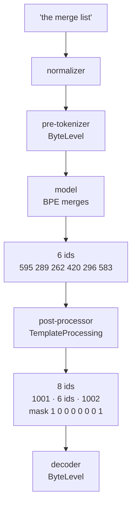

# 2.1 — The post-processor is where BOS and EOS come from

## One-line answer

Adding a token to the vocabulary does not put it anywhere; a **post-processor** is the stage that wraps
every encoded sequence, and installing one takes `the merge list` from **6 ids to 8** and — this is the part
people miss — is what finally makes `special_tokens_mask` non-zero.

---

## The story

A parcel office has a rubber stamp that reads `RECEIVED` and a date wheel.

Having the stamp on the desk does not stamp anything. Somebody has to pick it up and press it on each parcel
as it comes in. The rule is written on a card above the desk: *stamp the top-left corner of every parcel,
on arrival, before it goes on the shelf.*

That card is the important object. Without it, two people work the same desk and one stamps the corner while
the other stamps the label, and a month later nobody can tell which parcels arrived on which day because the
stamps are in different places and some are missing entirely.

The stamp is a tool. The card is the policy. Confusing the two is how a shelf full of parcels stops being a
record.

---

## The idea in plain language

Day 14 part
[2.1](../../../day-014-tiktoken-and-the-pipeline/parts/02-the-tokenizers-pipeline/2.1-five-stages-not-one.md)
laid out the five stages a `tokenizers` pipeline runs in order: normalizer, pre-tokenizer, model,
post-processor, decoder. Sections 1 of this day has been working on the **model** stage's vocabulary —
adding entries. The **post-processor** is a different stage, and it is the one that decides where those
entries get placed.

A post-processor takes the list of ids the model produced and rewrites it: it can add ids at the front, add
ids at the back, and mark which positions are structure rather than content. `TemplateProcessing` is the one
that does this from a written pattern:

```
single = "<|bos|> $A <|eos|>"
```

`$A` is the sequence you encoded. Everything else is literal, and every literal has to be a token the
tokenizer already knows — which is why part
[1.3](../01-special-tokens/1.3-added-tokens-sit-above-the-vocabulary.md) came first.

**Three things become true the moment you install one:**

1. Every call to `encode` gets the wrapper. You cannot forget it, because you are no longer the one applying
   it.
2. `num_special_tokens_to_add()` starts returning a non-zero number, so code that budgets a context window
   can subtract the overhead honestly.
3. `special_tokens_mask` starts marking positions. Part
   [1.4](../01-special-tokens/1.4-special-means-decode-drops-it.md) measured that mask as **all zeros** even
   with a properly registered special token sitting in the middle of the string. The mask is not about which
   tokens are special; it is about which **positions were added by the post-processor**. That distinction is
   the single most useful thing in this document.

**And the wrapper travels in the saved file.** The post-processor is serialized into `tokenizer.json`
alongside the vocabulary and the merges. Day 14 part
[3.1](../../../day-014-tiktoken-and-the-pipeline/parts/03-the-remaining-gap/3.1-the-file-is-the-contract.md)
made the case that the file is the contract; this is another clause of it. A tokenizer that wraps and one
that does not are two different functions, and only the file records which one you have.

---

## Why Akshara needs it

Day 62 builds the pretraining data pipeline: documents in, fixed-length training sequences out. Every
document needs a boundary marker, and there are two places that marker could be applied — in the data
script, by hand, or in the tokenizer, by policy.

Put it in the data script and you have written the parcel office's rule on a sticky note. Day 88's
fine-tuning script is a different file, written later, and it will apply the marker slightly differently or
not at all. That is Silent Failure #2, and section
[05](../05-template-mismatch/5.1-one-character-three-tokens-a-different-model.md) measures what it costs.

Put it in the tokenizer and there is exactly one definition, it is serialized into the file the model ships
with, and every script that loads the tokenizer inherits it whether or not its author was thinking about
boundaries that day.

---

## The mechanism

```python
# lab/attach_01.py  -  T0, laptop CPU.
import pathlib

from tokenizers import Tokenizer, decoders, models, pre_tokenizers, processors, trainers

text = pathlib.Path("docs/00_MASTER_PLAN.md").read_text(encoding="utf-8")
tok = Tokenizer(models.BPE())
tok.pre_tokenizer = pre_tokenizers.ByteLevel(add_prefix_space=False)
tok.decoder = decoders.ByteLevel()
tok.train_from_iterator(
    [text],
    trainer=trainers.BpeTrainer(
        vocab_size=1000, show_progress=False,
        initial_alphabet=pre_tokenizers.ByteLevel.alphabet(),
    ),
)
tok.add_special_tokens(["<|pad|>", "<|bos|>", "<|eos|>", "<|unk|>"])
bos, eos = tok.token_to_id("<|bos|>"), tok.token_to_id("<|eos|>")

S = "the merge list"
print("before:", tok.encode(S).ids)
print("  num_special_tokens_to_add:", tok.num_special_tokens_to_add(False))

tok.post_processor = processors.TemplateProcessing(
    single="<|bos|> $A <|eos|>",
    special_tokens=[("<|bos|>", bos), ("<|eos|>", eos)],
)

enc = tok.encode(S)
print("after :", enc.ids)
print("  tokens             :", enc.tokens)
print("  special_tokens_mask:", enc.special_tokens_mask)
print("  attention_mask     :", enc.attention_mask)
print("  num_special_tokens_to_add:", tok.num_special_tokens_to_add(False))
print("  decode()           :", repr(tok.decode(enc.ids)))
print("  decode(skip=False) :", repr(tok.decode(enc.ids, skip_special_tokens=False)))
```

**Line by line:**

- `bos, eos = tok.token_to_id(...)` resolves the ids from the tokenizer rather than writing `1001` and
  `1002` as literals. Those two integers depend on the order the tokens were added and on the trained
  vocabulary size, both of which change if anybody edits the trainer. A literal here is a time bomb with a
  one-line fuse.
- `single="<|bos|> $A <|eos|>"` uses spaces as the pattern's own separator between placeholders. They are
  not tokens — the pattern language splits on them — so no stray space enters the id sequence. The
  measurement below confirms it: the ids either side of the content are the markers and nothing else.
- `special_tokens=[("<|bos|>", bos), ("<|eos|>", eos)]` restates the mapping the template will use. It is
  redundant-looking and it is not redundant: the template is a **string**, and this list is what binds each
  literal in that string to an integer. Get it wrong and you get an error rather than a silently wrong id,
  which is the right trade.
- `num_special_tokens_to_add(False)` is printed before **and** after. The `False` means "for a single
  sequence rather than a pair", and the before/after pair is what shows that this number is a property of
  the post-processor and not of the vocabulary.

Measured on this machine, 2026-08-29, corpus sha256 `9760f2b6d4340b97`:

```text
before: [595, 289, 262, 420, 296, 583]
  num_special_tokens_to_add: 0
after : [1001, 595, 289, 262, 420, 296, 583, 1002]
  tokens             : ['<|bos|>', 'the', 'Ġm', 'er', 'ge', 'Ġl', 'ist', '<|eos|>']
  special_tokens_mask: [1, 0, 0, 0, 0, 0, 0, 1]
  attention_mask     : [1, 1, 1, 1, 1, 1, 1, 1]
  num_special_tokens_to_add: 2
  decode()           : 'the merge list'
  decode(skip=False) : '<|bos|>the merge list<|eos|>'
```

Six ids became eight. `num_special_tokens_to_add` went from 0 to 2. And `special_tokens_mask` is
`[1, 0, 0, 0, 0, 0, 0, 1]` — non-zero at last, marking exactly the two positions the post-processor put
there. Compare that with part [1.4](../01-special-tokens/1.4-special-means-decode-drops-it.md)'s all-zero
mask on a string containing a registered special token: the mask never described the tokens, it described
the positions this stage inserted.

Note `attention_mask` is all ones. BOS and EOS are real positions that the model must attend to; they are
structure, but they are not absent. Part
[2.2](2.2-the-pad-token-that-is-also-the-end-token.md) is where the two masks finally disagree.



---

## Shapes

The post-processor changes the length of every sequence, which is the `T` axis of every tensor downstream of
it. `B` is batch, `T` is sequence position, `V` is vocabulary size.

| Tensor | Symbolic shape | Concrete here | What each axis means |
| --- | --- | --- | --- |
| ids, before the post-processor | `(T,)` | `(6,)` | one entry per token the merge loop produced |
| ids, after the post-processor | `(T + 2,)` | `(8,)` | the same tokens, plus BOS at 0 and EOS at the end |
| `special_tokens_mask` | `(T + 2,)` | `(8,)` | `1` where **this stage** inserted a position, `0` elsewhere |
| `attention_mask` | `(T + 2,)` | `(8,)` | `1` where a position is real; all ones here, since nothing is padding yet |
| a batch, after padding | `(B, T_max)` | `(3, 16)` | measured in part [2.2](2.2-the-pad-token-that-is-also-the-end-token.md) |

The `+ 2` is the whole reason `num_special_tokens_to_add` exists. When Day 63 packs documents into a fixed
context window of `T = 1024`, the budget for real content is `1024 - num_special_tokens_to_add`, and a
pipeline that forgets the subtraction truncates two tokens off the end of every single sequence.

---

## When it breaks

**The loud version.** Write a template naming `<|start|>`, which the tokenizer does not have, and declare
only `<|bos|>` in `special_tokens`:

```text
Traceback (most recent call last):
  File "attach_01.py", line 24, in <module>
    tok.post_processor = processors.TemplateProcessing(
ValueError: Missing SpecialToken(s) with id(s) `<|eos|>, <|start|>`
```

Read the list of names in that message carefully, because it says something the code did not. `<|start|>` is
missing for the obvious reason — no such token exists. But **`<|eos|>` is in the message too**, and `<|eos|>`
is very much in the vocabulary: it was added a few lines earlier and has id 1002.

The rule this reveals is that `TemplateProcessing` does not consult the vocabulary at all. Every literal in
the pattern must appear in the `special_tokens=` argument, and that argument is the *only* place it looks. A
token that exists but is not declared is exactly as missing as a token that does not exist. That is a
stricter contract than it first appears, and it is the right one: the template and its bindings are one
object, written together, and neither half can quietly drift from a vocabulary edited somewhere else.

**The silent version.** Install no post-processor and everything still works. Sequences encode, decode,
round-trip. `num_special_tokens_to_add()` returns 0 and `special_tokens_mask` returns all zeros, both of
which are *true statements* about a tokenizer that adds nothing. Then training runs on documents with no
boundary between them, and the model learns that a section about tokenization is followed by a section about
attention because that is what the concatenated stream said. Nothing errors. The model is simply worse in a
way no metric names.

**The check that catches it,** and it can go red:

```python
probe = "the merge list"
enc = tok.encode(probe)
assert enc.ids[0] == bos, f"sequence does not start with BOS - first id is {enc.ids[0]}"
assert enc.ids[-1] == eos, f"sequence does not end with EOS - last id is {enc.ids[-1]}"
assert tok.num_special_tokens_to_add(False) == 2, (
    "the post-processor adds "
    f"{tok.num_special_tokens_to_add(False)} tokens, not 2 - your context budget is wrong by "
    "that many positions on every sequence"
)
assert sum(enc.special_tokens_mask) == 2, "the mask does not mark both wrapper positions"
```

**Line by line:**

- The first two assertions compare against `bos` and `eos`, the variables resolved from the tokenizer, not
  against `1001` and `1002`. A test that hardcodes the ids passes when the vocabulary changes underneath it,
  which is the one moment you needed it to fail.
- `num_special_tokens_to_add(False) == 2` is the assertion that guards the **context budget**, and its
  message says so. A wrapper that grew from two tokens to four — because somebody added a system marker —
  silently steals two positions per sequence from every dataset built afterwards.
- `sum(enc.special_tokens_mask) == 2` checks the mask rather than the ids, which is a genuinely different
  claim. The ids could be right while the mask is wrong, and the mask is what the loss-masking code on Day
  57 will read.

---

## In production

**Pairs, not just singles.** `TemplateProcessing` also takes a `pair=` pattern, used when a model is fed two
segments at once — a question and a passage, for instance. That pattern typically inserts a separator marker
between them and gives the second segment a different `type_id`, which is a per-position integer saying
which segment a token belongs to. Akshara is a decoder-only model and does not use segment pairs, so this
part does not build one; the reason to know it exists is that `num_special_tokens_to_add(True)` returns the
*pair* overhead and will not match the single overhead.

**What a research engineer checks first on a new model.** Not the vocabulary. The post-processor. Whether a
tokenizer prepends BOS is one of the highest-leverage facts about it, because a model trained with a leading
BOS and served without one has every position shifted by one relative to what it saw in training — and it
still produces fluent text. Day 14 part
[3.3](../../../day-014-tiktoken-and-the-pipeline/parts/03-the-remaining-gap/3.3-the-mismatch-the-library-will-not-catch.md)
measured the sibling of this failure for the pre-tokenizer; the post-processor version is quieter, because
the difference is one id at position zero rather than a different segmentation throughout.

**The review comment:** *"Does this tokenizer add BOS, and does the serving path use the same tokenizer
object or a rebuilt one?"* The second half is the real question. Rebuilding a tokenizer at serving time from
a vocabulary file, rather than loading the saved `tokenizer.json`, drops the post-processor — the vocabulary
file does not carry one — and the sequences arrive without their wrapper.

**The interview question:** *"What is `special_tokens_mask` for, and how is it different from
`attention_mask`?"* The honest answer, which very few people give, starts by saying what the mask is
*computed from*: positions the post-processor inserted, not tokens flagged special. Then the difference is
easy — `attention_mask` says which positions are real, `special_tokens_mask` says which real positions are
structure. Part [2.2](2.2-the-pad-token-that-is-also-the-end-token.md) shows a batch where they disagree.

---

## Check yourself

Run this — it prints two id counts and two masks, not a pass:

```text
uv run python -c "
from tokenizers import Tokenizer, models, pre_tokenizers, decoders, trainers, processors
import pathlib
t = Tokenizer(models.BPE()); t.pre_tokenizer = pre_tokenizers.ByteLevel(add_prefix_space=False)
t.decoder = decoders.ByteLevel()
t.train_from_iterator([pathlib.Path('docs/00_MASTER_PLAN.md').read_text(encoding='utf-8')],
  trainer=trainers.BpeTrainer(vocab_size=1000, show_progress=False,
                              initial_alphabet=pre_tokenizers.ByteLevel.alphabet()))
t.add_special_tokens(['<|pad|>','<|bos|>','<|eos|>','<|unk|>'])
b, e = t.token_to_id('<|bos|>'), t.token_to_id('<|eos|>')
print('without post-processor:', len(t.encode('the merge list').ids), t.num_special_tokens_to_add(False))
t.post_processor = processors.TemplateProcessing(single='<|bos|> \$A <|eos|>',
    special_tokens=[('<|bos|>', b), ('<|eos|>', e)])
enc = t.encode('the merge list')
print('with post-processor   :', len(enc.ids), t.num_special_tokens_to_add(False))
print('special_tokens_mask   :', enc.special_tokens_mask)
print('attention_mask        :', enc.attention_mask)
"
```

Expected: `6 0`, then `8 2`, then `[1, 0, 0, 0, 0, 0, 0, 1]` and eight ones.

Then answer out loud, without scrolling up:

1. `special_tokens_mask` was all zeros in part 1.4 and non-zero here, for a string containing the same kind
   of token. State the rule that explains both.
2. Your context window is 1024. How many positions can carry real content, and where does the number come
   from?
3. A serving path rebuilds the tokenizer from a vocabulary file instead of loading `tokenizer.json`. Name
   the thing that goes missing and the symptom it produces.
