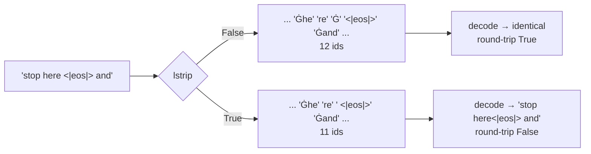

# 2.4 — 💥 `lstrip`, and the space that never came back

## One-line answer

`AddedToken("<|eos|>", lstrip=True)` makes the marker swallow the space in front of it — the token becomes
the four-character string `' <|eos|>'` — and the round-trip that has held since Day 13 breaks: `'stop here
<|eos|> and no further'` decodes back as `'stop here<|eos|> and no further'`, one space short, with no error
at any stage.

---

## The story

You are labelling jars in a kitchen with sticky paper tape.

The tape is a little wider than the words on it, so when you stick the label for *rice* on the jar, the tape
covers the small pencil mark you had made just to its left — a mark showing the fill line.

You do not notice, because the label is on and the label is correct. Weeks later somebody asks where the
fill line went. It is under the label. It was always under the label. Nothing went wrong when you stuck it
on; the tape simply took a bit more of the jar than the word needed.

---

## The idea in plain language

Part [1.3](../01-special-tokens/1.3-added-tokens-sit-above-the-vocabulary.md) printed what the tokenizer
knows about each token you add, and the printout had five flags in it that were all `False`:

```
AddedToken("<|eos|>", rstrip=False, lstrip=False, single_word=False, normalized=False, special=True)
```

Those are not decorations. They are the matching rules, and `add_special_tokens(["<|eos|>"])` — a plain
string — takes every default. Passing an `AddedToken` object instead lets you change them, and two of them
change how much text the marker consumes:

| Flag | What the marker matches |
| --- | --- |
| `lstrip=True` | the marker **and any whitespace to its left** |
| `rstrip=True` | the marker **and any whitespace to its right** |

The reason anybody wants this is real. Day 13 part
[2.2](../../../day-013-bpe-encode-decode-bytes/parts/02-the-regex-pre-tokenizer/2.2-the-gpt-pattern-symbol-by-symbol.md)
established that in a byte-level tokenizer the space belongs to the *following* word — `Ġthat` is one token
meaning "space, then that". So a marker sitting between two words leaves a lone space token stranded on
either side of it, and those stranded spaces are ids the model has to learn to produce in exactly the right
places. Absorbing them into the marker makes the boundary cleaner and the sequence shorter.

**The price is that the tokenizer stops being a bijection.** Day 9 part
[2.1](../../../day-009-the-vocabulary-problem/parts/02-what-a-tokenizer-is/2.1-a-function-and-its-inverse.md)
defined a tokenizer as a function and its inverse, and Day 13 part
[3.3](../../../day-013-bpe-encode-decode-bytes/parts/03-byte-level-bpe/3.3-zero-out-of-vocabulary.md) made
losslessness the property that the whole byte-level design exists to guarantee. `lstrip=True` gives that up
for one token — the encoder maps two different strings to the same ids, and the decoder has to pick one when
it comes back.

That is not automatically wrong. It is a trade, and the phase gate this section feeds is *"your BPE
tokenizer round-trips every byte of a UTF-8 corpus"*, so on Day 16 it is a trade Akshara declines. But you
have to have seen it break to know what you are declining.

---

## Why Akshara needs it

Day 17 is the tokenizer failure lab, and TOK-19 is *token healing and the trailing-space bug* — the family
of failures where a space at a boundary changes the ids and therefore the model's continuation. This part is
the version of that bug you can create yourself, on purpose, with one keyword argument, and watch a
round-trip assertion go red.

More immediately: section [04](../04-chat-templates/4.3-the-generation-prompt.md) builds a chat template
whose final token before generation is a **newline**, and part
[5.1](../05-template-mismatch/5.1-one-character-three-tokens-a-different-model.md) measures what happens when
that final token is a space instead. Whitespace at a marker boundary is not a detail on this day. It is the
day's recurring subject, and this is where it is introduced deliberately rather than by accident.

---

## The mechanism

Two tokenizers, identical except for one keyword.

```python
# lab/attach_04.py  -  T0, laptop CPU. Uses fresh() from lab/specials_04.py.
from tokenizers import AddedToken

S = "stop here <|eos|> and no further"

strict = fresh()
strict.add_special_tokens([AddedToken("<|eos|>", lstrip=False, rstrip=False)])

greedy = fresh()
greedy.add_special_tokens([AddedToken("<|eos|>", lstrip=True, rstrip=False)])

for name, tok in (("lstrip=False", strict), ("lstrip=True", greedy)):
    enc = tok.encode(S)
    back = tok.decode(enc.ids, skip_special_tokens=False)
    print(name)
    print("  tokens     :", enc.tokens)
    print("  n ids      :", len(enc.ids))
    print("  decoded    :", repr(back))
    print("  round-trips:", back == S)
```

**Line by line:**

- `AddedToken(...)` is passed instead of the bare string `"<|eos|>"`. That is the entire difference between
  this part and part [1.3](../01-special-tokens/1.3-added-tokens-sit-above-the-vocabulary.md); a string
  takes the defaults, an object states them.
- `lstrip=False, rstrip=False` is spelled out on the `strict` tokenizer even though both are defaults. The
  two objects sit four lines apart and the reader has to be able to see the difference without knowing the
  defaults by heart — which is also the argument for spelling them out in real code.
- `skip_special_tokens=False` on the decode, because the round-trip claim is about the *whole* string
  including the marker. With the default `True` the marker would be dropped and the comparison would fail
  for the reason part [1.4](../01-special-tokens/1.4-special-means-decode-drops-it.md) measured, masking the
  reason this part is about.
- `back == S` is printed rather than asserted, so both branches run and the reader sees the pair. An assert
  here would stop at the first failure and hide the contrast, which is the finding.

Measured on this machine, 2026-08-29, corpus sha256 `9760f2b6d4340b97`, `tokenizers` 0.23.1:

```text
lstrip=False
  tokens     : ['st', 'op', 'Ġhe', 're', 'Ġ', '<|eos|>', 'Ġand', 'Ġno', 'Ġf', 'ur', 'the', 'r']
  n ids      : 12
  decoded    : 'stop here <|eos|> and no further'
  round-trips: True
lstrip=True
  tokens     : ['st', 'op', 'Ġhe', 're', ' <|eos|>', 'Ġand', 'Ġno', 'Ġf', 'ur', 'the', 'r']
  n ids      : 11
  decoded    : 'stop here<|eos|> and no further'
  round-trips: False
```

Read the token lists. Under `lstrip=False` there is a standalone `'Ġ'` at position 4 — the lone space token,
carrying nothing but itself. Under `lstrip=True` that token is gone and the marker has become `' <|eos|>'`,
with a real leading space inside the token string. Twelve ids became eleven: the space was not deleted, it
was **absorbed**.

Then the decode. `'stop here<|eos|> and no further'` — `here` and the marker now touch. The original string
had a space there. The tokenizer round-tripped every byte on Day 13, round-tripped every byte on Day 14,
round-tripped every byte an hour ago, and does not round-trip now, and nothing raised.



---

## When it breaks

**There is no loud version. That is the entire lesson of this part**, and it is worth stating flatly:
`lstrip=True` is a supported, documented, deliberate option. The library is not malfunctioning. Every
individual operation is correct. Only the composition of encode and decode has lost a property nobody
re-checked.

**The silent version, verbatim.** The two strings, one under the other:

```text
in  : 'stop here <|eos|> and no further'
out : 'stop here<|eos|> and no further'
```

One character. In a training corpus that difference is invisible in every summary statistic you would think
to compute — the token count moves by one per occurrence, the vocabulary is unchanged, the loss is
unaffected. It shows up at inference, as a model that has learned that `here` and the marker are adjacent
and therefore generates text with the spacing subtly wrong at every turn boundary.

**Why the existing check does not catch it.** Day 14 part
[3.3](../../../day-014-tiktoken-and-the-pipeline/parts/03-the-remaining-gap/3.3-the-mismatch-the-library-will-not-catch.md)
built `assert_same_tokenizer`, which compares two tokenizers by encoding probes through both and comparing
ids. Run it here and it passes — because you only have one tokenizer, and it agrees with itself. The
property that broke is not agreement between two encoders. It is agreement between one encoder and its own
decoder.

**The check that catches it,** and it can go red:

```python
probes = [
    "stop here <|eos|> and no further",
    "<|eos|>leading marker",
    "trailing marker <|eos|>",
    "double  space  <|eos|>  after",
    "tab\tbefore <|eos|>",
]
bad = []
for p in probes:
    back = tok.decode(tok.encode(p).ids, skip_special_tokens=False)
    if back != p:
        bad.append((p, back))
assert not bad, "\n".join(f"  in : {a!r}\n  out: {b!r}" for a, b in bad)
print(f"{len(probes)} probes round-tripped")
```

**Line by line:**

- The probes put the marker in five different whitespace neighbourhoods, because `lstrip` and `rstrip` are
  *positional* faults. A single probe with the marker mid-sentence would miss an `rstrip=True` tokenizer
  entirely, and a probe set that only tests the happy position is a probe set that tests nothing.
- `"tab\tbefore"` is there because "whitespace" is not only the space character. Day 15 part
  [3.1](../../../day-015-wordpiece-unigram-sentencepiece/parts/03-sentencepiece/3.1-the-metaspace-trick.md)
  measured a tab being lost by a pre-tokenizer, so a tab is a known-dangerous input in this repository, not
  a hypothetical one.
- Failures are **collected**, not raised on first sight. Five probes and one run tells you the shape of the
  fault — leading only, trailing only, all of them — and the shape is what names the flag.
- The message prints `in` and `out` on separate lines with `repr`. A one-character whitespace difference
  shown inline, unquoted, is a message the reader will stare at and see nothing wrong with.

---

## In production

**Where `lstrip=True` is genuinely correct.** Masked-language models are the classic case: a `[MASK]` token
standing in for a word wants to absorb the space that would have preceded that word, so that filling the
mask produces natural text without a doubled or missing space. That is a real design, shipped widely, and it
is right for that architecture. What makes it right there is that those models are not asked to reproduce
their input byte for byte.

**Why Akshara says no.** The phase gate for Days 9–17 is that the tokenizer round-trips every byte of a
UTF-8 corpus. `lstrip=True` fails that gate by construction, for a compression gain measured here at one
token per marker occurrence. On a chat corpus with two markers per turn that is real, and it is still the
wrong trade for a model whose correctness argument rests on losslessness.

**How this is caught in a real repository.** Not by a reviewer noticing a keyword argument. By the
round-trip probe set above, running in CI over the saved `tokenizer.json`, so the property is checked
against the artifact that ships rather than against the code that built it. Day 14 part
[3.1](../../../day-014-tiktoken-and-the-pipeline/parts/03-the-remaining-gap/3.1-the-file-is-the-contract.md)
made the case that the file is the contract; a test that reads the file is a test of the contract.

**The failure that only appears with real data.** `lstrip` absorbs *any* run of whitespace, not one space.
A marker preceded by a newline and four spaces of indentation — which happens constantly in a code corpus —
loses all five characters. The token count drops by more, the corruption is larger, and it is still silent.

**The review comment:** *"`AddedToken` with non-default flags — does the round-trip suite still pass?"* If
the answer is "there is no round-trip suite", the flags are not the problem to fix first.

**The interview question:** *"What does `lstrip` on an added token do, and why would you not want it?"* An
answer that names the compression gain **and** the losslessness cost, and then says which one your model's
correctness depends on, is an answer from somebody who has had to decide. Naming only the cost sounds like a
rule learned from a checklist.

---

## Check yourself

Run this — it prints two token counts and two booleans, not a pass:

```text
uv run python -c "
from tokenizers import Tokenizer, AddedToken, models, pre_tokenizers, decoders, trainers
import pathlib
def fresh():
    t = Tokenizer(models.BPE()); t.pre_tokenizer = pre_tokenizers.ByteLevel(add_prefix_space=False)
    t.decoder = decoders.ByteLevel()
    t.train_from_iterator([pathlib.Path('docs/00_MASTER_PLAN.md').read_text(encoding='utf-8')],
      trainer=trainers.BpeTrainer(vocab_size=1000, show_progress=False,
                                  initial_alphabet=pre_tokenizers.ByteLevel.alphabet()))
    return t
S = 'stop here <|eos|> and no further'
for flag in (False, True):
    t = fresh(); t.add_special_tokens([AddedToken('<|eos|>', lstrip=flag, rstrip=False)])
    ids = t.encode(S).ids
    back = t.decode(ids, skip_special_tokens=False)
    print(f'lstrip={flag}: {len(ids)} ids, round-trips={back == S}, {back!r}')
"
```

Expected: `lstrip=False: 12 ids, round-trips=True`, then `lstrip=True: 11 ids, round-trips=False` with the
space missing before the marker.

Then answer out loud, without scrolling up:

1. What did `lstrip=True` buy, in tokens, and what did it cost, as a property? Give both as one sentence.
2. `assert_same_tokenizer` from Day 14 passes here. Say precisely why, and name the property it checks
   instead.
3. Your probe set has one probe, with the marker in the middle of a sentence. Name a fault it cannot catch.
4. A code corpus makes this worse than a prose corpus. Why?
