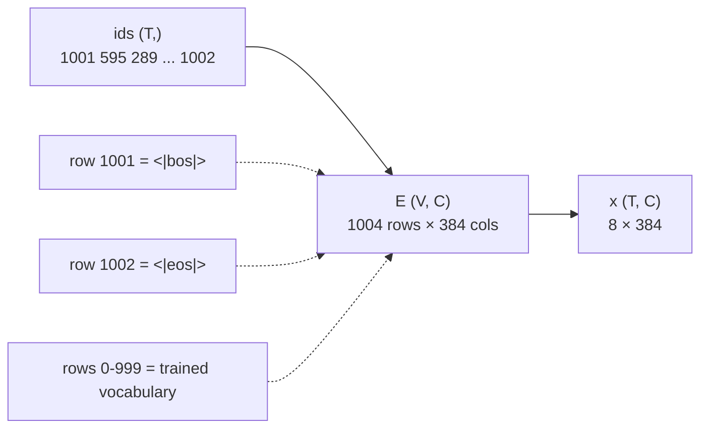

# 3.1 — One row per id

## One-line answer

An embedding matrix is a table with exactly one row per vocabulary id and `C` numbers in each row, so
"looking up a token" is not a computation at all — it is `E[id]`, and the shape `(V, C)` is the only reason
a token id has to be a small integer rather than a string.

---

## The story

A hostel has a wall of pigeonholes for post — one small box per resident, numbered 1 to 240.

To fetch someone's post you do not search. You do not read names. You walk to the box with their number on
it and take what is inside. The number **is** the address.

That is why the hostel gives every resident a number on the day they arrive, and why the number is small and
sequential rather than, say, their phone number. The wall was built with 240 boxes. A resident numbered
9,140,532 has nowhere to stand.

And when a 241st person arrives, somebody has to build another box. Not rename anything, not reorganise —
build a box, physically, at the end of the row.

---

## The idea in plain language

Every day so far has turned text into a list of integers and stopped there. This is where the integers meet
the model.

A model does not work with integers. It works with **vectors** — lists of real numbers — because a vector
can be added, scaled, and compared for similarity, and an id cannot. Id 471 (`end`) and id 472 are adjacent
integers with no relationship whatsoever; the numbering came out of a merge loop's ordering, not out of
meaning.

So the first thing a model does with a token id is exchange it for a vector. The exchange table is called
the **embedding matrix**:

- It has `V` rows, one for every id the tokenizer can produce (which part
  [1.3](../01-special-tokens/1.3-added-tokens-sit-above-the-vocabulary.md) established is
  `get_vocab_size(with_added_tokens=True)`, not the trained size).
- It has `C` columns. `C` is the **model width**, written `d_model` in papers and `C` for "channels"
  throughout this curriculum. It is a number you choose; nothing about the tokenizer determines it.
- Every one of those `V × C` numbers is **learned**. The table starts as random noise and gradient descent —
  Day 8 — moves every row that ever appears in a training batch.

**"Embedding lookup" is a name for indexing.** There is no computation, no search, no similarity metric.
`E[471]` returns row 471. That is the whole operation, and it is worth being blunt about because the word
"embedding" sounds like it must involve something clever.

**Why the id has to be a small dense integer** now has an answer, and it is the pigeonhole wall. Ids are row
numbers. A vocabulary whose ids ran 0, 7, 300000 would need a table with 300,001 rows to hold three tokens.
Day 13 part
[1.3](../../../day-013-bpe-encode-decode-bytes/parts/01-encode-and-decode/1.3-from-tokens-to-ids.md) built
the token-to-id map without saying why the ids had to be contiguous. This is why.

---

## Why Akshara needs it

Day 36 builds Akshara's embedding layer and Day 39 assembles the model around it. The first line of that
model is this table, and its first dimension is the number section
[01](../01-special-tokens/1.1-four-jobs-four-tokens.md) spent four documents establishing.

But the reason it belongs on Day 16 rather than Day 36 is narrower: **TOK-16 is about adding tokens**, and
you cannot understand what adding a token costs, or what it breaks, without knowing that a token is a row.
Part [3.2](3.2-growing-the-table.md) grows the table by four rows; part
[3.4](3.4-the-head-that-was-never-grown.md) forgets to. Neither is meaningful until this document has said
what a row is.

---

## The mechanism

Written in plain Python, with no library, because the operation is genuinely this simple and a framework's
`nn.Embedding` would hide the one thing worth seeing.

```python
# lab/embed_01.py  -  T0, laptop CPU. Plain Python: no numpy, no torch.
import random

V, C = 1004, 384          # V rows: every id the tokenizer can emit (part 1.3)
                          # C columns: the model width, chosen here

rng = random.Random(1337)                                        # Principle 9: seed everything
E = [[rng.gauss(0.0, 0.02) for _ in range(C)] for _ in range(V)]  # (V, C)

print("rows      :", len(E))
print("columns   :", len(E[0]))
print("parameters:", len(E) * len(E[0]))

ids = [1001, 595, 289, 262, 420, 296, 583, 1002]   # (T,) from part 2.1
x = [E[i] for i in ids]                            # (T, C)  <- the entire lookup
print("sequence  :", len(ids), "ids ->", len(x), "vectors of", len(x[0]))
print("row 1002 first 4 numbers:", [round(v, 4) for v in E[1002][:4]])
```

**Line by line:**

- `V, C = 1004, 384` names both dimensions on one line with a comment each, because every bug in this
  section is a confusion between them. `1004` is the measured value from part
  [1.3](../01-special-tokens/1.3-added-tokens-sit-above-the-vocabulary.md); `384` is chosen here and nothing
  depends on the choice.
- `random.Random(1337)` is a **local** generator rather than the module-level `random.gauss`. A function
  whose output depends on an unseeded global is a bug (Principle 9), and a local generator cannot be
  disturbed by any other code that also seeds.
- `rng.gauss(0.0, 0.02)` initialises from a normal distribution centred on zero with a small spread. The
  `0.02` is a value chosen for this document so the numbers are readable; *why* embedding initialisations
  are small is Day 53's subject, and this part deliberately does not claim a reason it has not derived.
- The comprehension builds **rows of `C`**, `V` times — that ordering is the shape `(V, C)`, and writing it
  the other way round produces a `(C, V)` table that indexes without error and returns the wrong thing.
- `x = [E[i] for i in ids]` is the lookup, and it is one line with no arithmetic in it. Everything else in
  this file is setup.
- `E[1002][:4]` prints part of the EOS row specifically. It exists, it is full of numbers, and no gradient
  has ever touched it — which is exactly the situation part
  [3.4](3.4-the-head-that-was-never-grown.md) is about.

Measured on this machine, 2026-08-29, seed 1337:

```text
rows      : 1004
columns   : 384
parameters: 385536
sequence  : 8 ids -> 8 vectors of 384
row 1002 first 4 numbers: [-0.0082, 0.0344, 0.038, -0.0095]
```

Eight ids in, eight vectors of 384 numbers out. The `(T,)` list of integers has become a `(T, C)` block of
real numbers, and every number in it was copied, not computed.



---

## Shapes

Curriculum-wide symbols: `B` batch · `T` sequence · `C` channels (`d_model`) · `V` vocabulary.

| Tensor | Symbolic shape | Concrete here | What each axis means |
| --- | --- | --- | --- |
| `ids` | `(T,)` | `(8,)` | position in the sequence → a token id |
| `E`, the embedding matrix | `(V, C)` | `(1004, 384)` | row = one vocabulary id; column = one learned feature |
| `x`, after the lookup | `(T, C)` | `(8, 384)` | row = one position; column = the same learned feature |
| a batch of ids | `(B, T)` | `(3, 16)` | the padded batch measured in part [2.2](../02-attaching-them/2.2-the-pad-token-that-is-also-the-end-token.md) |
| a batch, embedded | `(B, T, C)` | `(3, 16, 384)` | the shape the rest of the model works in, from Day 36 on |

**The axis to keep straight** is the first one of `E`. It is indexed by *vocabulary*, and every other tensor
in the table is indexed by *position*. They have nothing to do with each other, and `T` is almost always far
smaller than `V` — 8 against 1004 here. A shape check that only verifies the last dimension will not notice
a transposed table, because `C` is on the right in both `(V, C)` and `(T, C)`.

---

## When it breaks

**The loud version.** Ask for a row that is not there:

```text
>>> E = [[0.0] * 384 for _ in range(1000)]
>>> E[1000]
Traceback (most recent call last):
  File "<stdin>", line 1, in <module>
IndexError: list index out of range
```

That is the exact message, measured on this machine on 2026-08-29. It names neither the table nor the id,
which is why part [1.3](../01-special-tokens/1.3-added-tokens-sit-above-the-vocabulary.md) put its assertion
at config-build time instead: an error at the point the sizes are chosen can say *which* sizes.

**The silent version, and Python hands it to you for free.** Negative indices do not raise:

```text
>>> E[-1] is E[999]
True
>>> E[-4] is E[996]
True
```

An id that arrives negative — from a sentinel meaning "unknown", or from an offset subtraction that ran one
step too far — quietly returns the *last* row of the table. A perfectly well-formed 384-number vector, of
the wrong token, for the whole run.

**The other silent version** is the transposed table. Build `(C, V)` instead of `(V, C)` and `E[5]` still
works — it returns a list of `V` numbers instead of `C` — and the failure appears many layers later as a
shape mismatch in a matmul, or, if `V` and `C` happen to be compatible, as a model that trains to a loss
that will not go down.

**The check that catches all three:**

```python
assert len(E) == V, f"table has {len(E)} rows, vocabulary needs {V}"
assert len(E[0]) == C, f"rows are {len(E[0])} wide, model width is {C}"
assert all(len(r) == C for r in E), "the table is ragged - some rows are the wrong width"
assert min(ids) >= 0, f"negative id {min(ids)} would silently index from the end"
assert max(ids) < V, f"id {max(ids)} is past the last row ({V - 1})"
print(f"E is ({len(E)}, {len(E[0])}); ids run {min(ids)}..{max(ids)}")
```

**Line by line:**

- The first two assertions check the two dimensions **separately** and against **named** values. `len(E) ==
  1004` would pass on a transposed table if `V` and `C` were ever equal, and more importantly it would not
  say which number is meant to be which.
- `all(len(r) == C for r in E)` catches a ragged table, which is impossible in a real tensor library and
  entirely possible in the plain-Python version this part uses. It is cheap and it is checking the thing the
  hand-rolled representation actually permits.
- `min(ids) >= 0` is the assertion for the failure that has no exception. It is the only line here that
  guards a *silent* fault, and it is the one that would be dropped first by somebody tidying up.
- The final `print` reports the shape and the id range as numbers, so a passing run still tells you
  something. An assertion block that prints nothing on success teaches the reader to ignore it.

---

## In production

**What a research engineer writes instead.** `nn.Embedding(V, C)` in PyTorch, which wraps a `(V, C)` tensor
and a gather operation. The reason to have written the list-of-lists once is that `nn.Embedding` has a
`padding_idx` argument, a `sparse` flag and a `max_norm`, and none of those are comprehensible until you
know that the object underneath is a table you index. Day 36 opens that class after Akshara has its own.

**What this costs at scale, in bytes.** The table is `V × C` numbers, and the arithmetic is worth doing
because it is the largest single tensor in a small model:

| `V` | `C` | Parameters | fp32 |
| --- | --- | --- | --- |
| 1,004 | 384 | 385,536 | 1.47 MiB |
| 32,000 | 768 | 24,576,000 | 93.75 MiB |
| 49,152 | 576 | 28,311,552 | 108.00 MiB |
| 200,019 | 768 | 153,614,592 | 585.99 MiB |

Computed on this machine, 2026-08-29. The `V` values are measured, not chosen: 1,004 from part
[1.3](../01-special-tokens/1.3-added-tokens-sit-above-the-vocabulary.md), 49,152 and 576 read from the
pinned model config in part
[2.2](../02-attaching-them/2.2-the-pad-token-that-is-also-the-end-token.md), and 200,019 printed by
`tiktoken.get_encoding("o200k_base").n_vocab` at version 0.14.0. The `C` values in rows 2 and 4 are chosen
for the arithmetic and are not claims about any model.

Read the last row against the third. A vocabulary four times larger costs four times the embedding memory,
for the same model width — and that trade, vocabulary size against everything else, is TOK-20 on Day 17.

**The failure that only shows with real data.** Rows for rare tokens receive gradients only when their token
appears in a batch. On a vocabulary of 200,000 trained on a corpus where the long tail appears a handful of
times, thousands of rows finish training barely moved from their initialization. They are not broken; they
are just nearly random, and the model's behaviour on the text that uses them is correspondingly arbitrary.
Part [3.2](3.2-growing-the-table.md) is the deliberate version of that situation.

**The interview question:** *"What is an embedding lookup, computationally?"* The answer is "an index into a
table" and it should take two seconds. If it takes longer, the person is reaching for something about
semantic space, which is a property the table *acquires* through training and not a description of the
operation.

---

## Check yourself

Run this — it prints a shape, a parameter count and a byte size, not a pass:

```text
uv run python -c "
import random
V, C = 1004, 384
rng = random.Random(1337)
E = [[rng.gauss(0.0, 0.02) for _ in range(C)] for _ in range(V)]
ids = [1001, 595, 289, 262, 420, 296, 583, 1002]
x = [E[i] for i in ids]
print('E shape    :', (len(E), len(E[0])))
print('parameters :', len(E) * len(E[0]))
print('fp32 bytes :', len(E) * len(E[0]) * 4)
print('x shape    :', (len(x), len(x[0])))
print('E[-1] is E[V-1]:', E[-1] is E[V - 1])
"
```

Expected: `(1004, 384)`, `385536`, `1542144`, `(8, 384)`, and `True` on the last line — that `True` is the
silent failure, not a reassurance.

Then answer out loud, without scrolling up:

1. Why must token ids be small and contiguous? Answer in terms of the table, not in terms of convention.
2. `E` is `(V, C)` and `x` is `(T, C)`. Which axis do they share, which do they not, and why is a check on
   the last dimension alone insufficient?
3. `E[-1]` returned a valid vector. Say what went wrong, in one sentence, and where you would put the check.
4. Row 1002 is full of numbers and no gradient has ever touched it. Is that a problem yet? Say when it
   becomes one.
