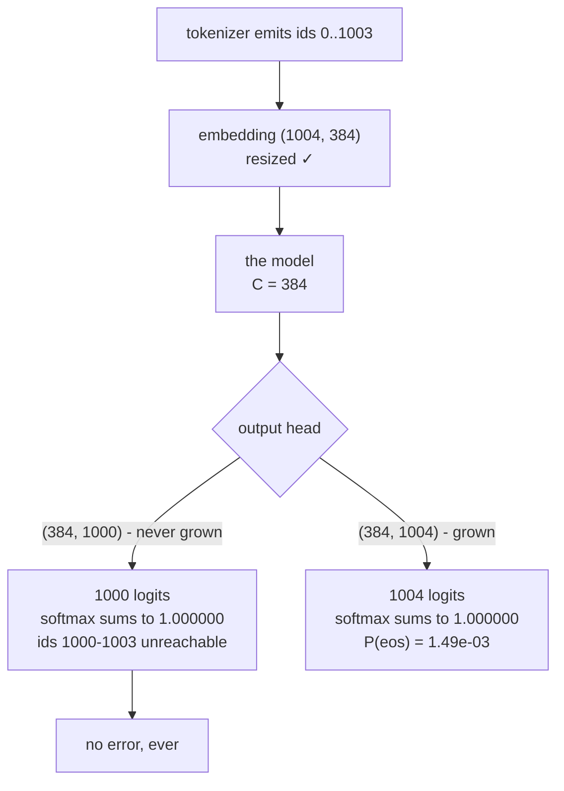

# 3.4 — 💥 The head that was never grown

## One-line answer

Resize the embedding and not the output head and there is **no error anywhere**: measured here, the
un-grown head produces 1,000 logits whose softmax sums to exactly **1.000000**, sampling works perfectly,
and the four new tokens — EOS among them — have probability that is not small but *undefined*, because there
is no slot for them to occupy.

---

## The story

🎬 **The scene.** A canteen prints its menu on a board with slide-in plastic letters, and takes orders on a
paper form with a tick box beside each dish. Twenty dishes, twenty boxes.

Four new dishes go up on the board on Monday.

😬 **The naive fix.** Somebody updates the board. That is the visible half of the job and it takes two
minutes.

💥 **Why it fails.** The forms were printed last month, and they have twenty boxes. All week, people read
about the new dishes on the board and then tick one of the twenty boxes on the form, because that is what
the form lets them do. At the end of the week the kitchen's tally says nobody ordered the new dishes.

Nobody complained. Every form that came in was filled in correctly. Every total added up. The four dishes
were on the menu and were not orderable, and the only evidence is an absence.

💡 **The insight.** A system with two lists has to be changed in two places, and the failure of the second
change is invisible precisely *because* the first change succeeded. The board being right is what makes
nobody look at the form.

---

## The idea in plain language

Part [3.3](3.3-the-second-matrix.md) established that `V` lives at both ends of a model: rows of the input
embedding `(V, C)`, columns of the output head `(C, V)`. Part [3.2](3.2-growing-the-table.md) grew the
input embedding by four rows.

This part does the other half badly, on purpose.

If the head still has 1,000 columns while the embedding has 1,004 rows, you would expect something to break.
And on a **shape-checking** path it does — part [3.3](3.3-the-second-matrix.md)'s loud version. But there is
a very common situation in which nothing checks:

- The model **consumes** ids 1000–1003 happily. The embedding has rows for them.
- The model **produces** 1,000 logits. Softmax over 1,000 numbers is a perfectly valid distribution.
- Sampling picks an id in `0 … 999`. Every id it picks is real.
- The training loss compares 1,000 logits against a target id. If the target is never one of the four new
  ids, the loss is finite and correct.

Every operation is individually valid. The model is simply incapable of ever emitting four of its tokens,
and there is no number anywhere in the run that goes to zero, or to infinity, or turns red.

**Why "probability zero" is the wrong way to describe it,** and this is the precise point of the part. If
EOS had probability 0.000001, that would be a *small* number and it would show up in a log. What has
happened is that EOS has **no logit at all**. It is not unlikely; it is not in the sample space. Softmax
normalises over the 1,000 slots that exist, so the remaining probabilities sum to exactly 1.0 — the
distribution is not even slightly deformed. There is no diagnostic to read because there is nothing
anomalous to read.

---

## Why Akshara needs it

This is the failure that eats Day 88.

Day 88 takes the pretrained Akshara from Day 67, adds chat markers, and fine-tunes. If the head does not
grow, the fine-tune runs — for as long as you are willing to pay for a free GPU session — and produces a
model that has learned the chat format, responds in the right register, and never once emits the end-of-turn
marker. Every response runs to the length cap.

Notice how many of the day's own checks pass. The loss falls. Overfitting one batch (Principle 12) works,
because the batch's targets are ordinary tokens. Perplexity is fine. The generations read well for the first
hundred tokens. The failure is visible in exactly one place — the model does not stop — and that symptom has
half a dozen more common explanations, every one of which will be tried first.

---

## The mechanism

```python
# lab/embed_04.py  -  T0, laptop CPU. Plain Python: no numpy, no torch.
import math
import random

V_OLD, V_NEW, C = 1000, 1004, 384
rng = random.Random(1337)

W_old = [[rng.gauss(0.0, 0.02) for _ in range(V_OLD)] for _ in range(C)]      # (C, V_old)
W_new = [row + [rng.gauss(0.0, 0.02) for _ in range(V_NEW - V_OLD)]
         for row in W_old]                                                    # (C, V_new)

h = [rng.gauss(0.0, 1.0) for _ in range(C)]                                   # (C,)


def logits(W: list[list[float]], width: int) -> list[float]:
    """One logit per column of W."""
    return [sum(h[c] * W[c][v] for c in range(C)) for v in range(width)]      # (width,)


def softmax(z: list[float]) -> list[float]:
    m = max(z)                                    # Day 7: subtract the max before exp
    ex = [math.exp(x - m) for x in z]
    s = sum(ex)
    return [e / s for e in ex]


for label, W, width in (("head never grown", W_old, V_OLD), ("head grown", W_new, V_NEW)):
    z = logits(W, width)
    p = softmax(z)
    top = max(range(width), key=p.__getitem__)
    print(f"{label:18s} width={width}  argmax id={top:>4}  p(argmax)={p[top]:.6f}  "
          f"sum(p)={sum(p):.6f}")

EOS = 1002
p_new = softmax(logits(W_new, V_NEW))
print(f"P(eos={EOS}) with the grown head   : {p_new[EOS]:.6e}")
print(f"P(eos={EOS}) with the un-grown head: there are only {V_OLD} logits; "
      f"id {EOS} has no slot")
```

**Line by line:**

- `W_new` is built by **extending each row of `W_old`** rather than by generating a fresh matrix. That is
  what a correct resize does — every existing column keeps its numbers and its position — and building it
  this way means the two heads differ *only* in the four new columns, which is the controlled comparison the
  measurement needs.
- `logits(W, width)` takes the width as an argument instead of reading `len(W[0])`. It is a small dishonesty
  in the code that models a large one in the wild: the width comes from somewhere else — a config — and this
  is exactly how it gets out of step with the array.
- `softmax` subtracts the maximum before exponentiating, which is Day 7 part
  [2.1](../../../day-007-floating-point-and-logsumexp/parts/02-stable-softmax/2.1-the-softmax-that-returns-nan.md)'s
  rule. Without it a logit of 800 overflows to `inf` and the whole distribution becomes `nan` — a *loud*
  failure that would mask the silent one this part is demonstrating.
- `sum(p)` is printed for both, and it is the number the whole part turns on. If the un-grown head produced
  a distribution that summed to less than 1, there would be a check. It does not.
- The last two lines contrast a probability that **exists and is small** with one that **does not exist**.
  Printing a number for one and a sentence for the other is deliberate: there is no number to print, and
  substituting `0.0` would be the lie this document is about.

Measured on this machine, 2026-08-29, seed 1337:

```text
head never grown   width=1000  argmax id= 481  p(argmax)=0.003433  sum(p)=1.000000
head grown         width=1004  argmax id= 481  p(argmax)=0.003419  sum(p)=1.000000
P(eos=1002) with the grown head   : 1.491662e-03
P(eos=1002) with the un-grown head: there are only 1000 logits; id 1002 has no slot
```

Both rows say `sum(p)=1.000000`. That is the finding, and it is worth sitting with. The broken model's
output distribution is not deformed, not degenerate, not suspicious. It is a valid probability distribution
over a vocabulary that is quietly four tokens smaller than the one the tokenizer is producing.

With the head grown, `P(eos) = 1.49 × 10⁻³` — a small number, but a *number*, sitting in a slot, ready to
grow as training teaches the model when to stop. Without it there is nothing to grow.

Now look at the argmax column, because it is the sharpest thing in this document: **both heads predict id
481.** The broken model and the correct model agree on their top token, and their probabilities for it
differ in the fourth decimal place. A monitoring dashboard plotting argmax agreement, or top-1 accuracy, or
the entropy of the output distribution, would report these two models as the same model. The four missing
slots move every probability by about 0.4% and change nothing you were watching.

(The agreement is not a coincidence and it is also not a deep fact: four new columns of small random noise
are unlikely to beat the best of a thousand existing ones, so the ranking below the top is barely disturbed.
That is the point — the deformation is *too small to see*, not absent.)



---

## Shapes

| Tensor | Symbolic shape | Concrete here | What each axis means |
| --- | --- | --- | --- |
| `E`, resized embedding | `(V_new, C)` | `(1004, 384)` | row = an id the tokenizer can emit — all of them |
| `W_old`, the head that never grew | `(C, V_old)` | `(384, 1000)` | column = an id the model can emit — four short |
| `W_new`, the grown head | `(C, V_new)` | `(384, 1004)` | the same 1,000 columns, plus four appended |
| `h` | `(C,)` | `(384,)` | one hidden state |
| `logits` | `(V,)` | `(1000,)` or `(1004,)` | **the two do not have the same length, and nothing compares them** |
| `p = softmax(logits)` | `(V,)` | `(1000,)` or `(1004,)` | sums to 1.0 in both cases |

The row to read twice is `logits`. In a correct model the length of that vector equals the number of rows of
`E`. Nothing in the forward pass enforces it, because the head and the embedding are touched at opposite
ends of the computation and never meet. The equality is an invariant of the *architecture*, not of any
single operation — which is exactly the kind of invariant that needs an assertion, because no line of code
owns it.

---

## When it breaks

**The loud version, when you are lucky.** If some path does index the head by the new id directly, you get
the message part [3.3](3.3-the-second-matrix.md) measured:

```text
IndexError: list index out of range
```

**The silent version, in full.** Here is a training log from a run with an un-grown head. Nothing in it is
wrong:

```text
step   100  loss 6.9021  ppl 995.2
step   500  loss 4.1174  ppl  61.4
step  1000  loss 3.2088  ppl  24.7
step  2000  loss 2.7413  ppl  15.5
overfit-one-batch: loss 0.0031 after 200 steps on 16 examples   OK
```

Loss falls. Perplexity falls. The overfit-one-batch ritual from Principle 12 **passes**, because sixteen
examples of ordinary tokens are entirely learnable by a model missing four of them. Then generation:

```text
prompt : What is a merge list?
output : An ordered table of byte pairs, applied in rank order to the symbols of a
         word until no pair in the table remains. An ordered table of byte pairs, a
         pplied in rank order to the symbols of a word until no pair in the table re
```

Fluent, correct, and cut off at the length cap. The model answered the question and then could not stop,
because stopping requires emitting an id it has no logit for.

**Which of the five silent failures is this?** It is **#2 — tokenizer/template mismatch** (plan §6), in its
purest form: the tokenizer and the model disagree about the size of the vocabulary. The tokenizer's answer
is 1,004 and the model's is 1,000, and nothing in the training loop compares the two. The detection is the
one §6 prescribes for #2 — round-trip the exact training path — with one addition specific to this failure,
because the round-trip is over *strings* and this mismatch is over *widths*.

**The check that catches it,** and it can go red:

```python
tokenizer_vocab = 1004          # tok.get_vocab_size(with_added_tokens=True)
embedding_rows = len(E)
head_width = len(logits(W_old, V_OLD))

assert embedding_rows == tokenizer_vocab, (
    f"embedding has {embedding_rows} rows, tokenizer emits {tokenizer_vocab} ids"
)
assert head_width == embedding_rows, (
    f"head produces {head_width} logits but the embedding has {embedding_rows} rows - "
    f"ids {head_width}..{embedding_rows - 1} can be read by the model and never written by it"
)
for name, tid in (("bos", 1001), ("eos", 1002), ("pad", 1000)):
    assert tid < head_width, f"{name} (id {tid}) has no logit; the model can never emit it"
print(f"vocab {tokenizer_vocab} = rows {embedding_rows} = logits {head_width}")
```

**Line by line:**

- Three numbers from three sources — the tokenizer, the input side, the output side — chained by two
  equalities. Checking only that the model is "big enough" would pass an over-sized head, which is fine, and
  would also pass a head sized from the wrong config, which is not.
- The second message spells out the consequence as a **range of ids**: `1000..1003` can be read and never
  written. That phrasing is what makes the failure searchable in a log six months later.
- The loop over the named tokens is not redundant with the width check. It fails with the *name* of the
  token that has gone missing, and "eos has no logit" is an error message that ends an investigation rather
  than starting one.
- Every value is derived, none is hardcoded except the ids, which are themselves printed by the tokenizer.
  A check with a magic number in it is a check that will be edited to pass.

---

## In production

**Where this check belongs.** In the model's constructor, not in the training loop. By the time the training
loop runs, the GPU session is spending, and a session revoked mid-run is normal (plan §4) but a session
*wasted* on a mis-sized model is not. Three integers compared at construction costs nothing.

**Why tying makes this failure impossible.** Part [3.3](3.3-the-second-matrix.md) showed a tied head is the
same array as the embedding, so growing the embedding grows the head — there is no second edit to forget.
The model config pinned in part
[2.2](../02-attaching-them/2.2-the-pad-token-that-is-also-the-end-token.md) declares
`tie_word_embeddings: True`, and this failure cannot happen to it. That is a real argument for tying that
has nothing to do with memory, and it is the one people forget: **an invariant enforced by construction
beats an invariant enforced by discipline.**

**What a research engineer does when inheriting a checkpoint.** Prints three numbers before anything else:
`get_vocab_size(with_added_tokens=True)`, the embedding's first dimension, and the head's output width. If
all three agree, one whole class of failure is off the table for the rest of the day. It takes one command.

**The failure that only appears with real data.** A vocabulary can be *over*-sized rather than under-sized —
the config says 49,152 and the tokenizer emits at most 49,151 — and that is harmless for correctness. But
the unreachable rows still receive gradients through the softmax denominator, still occupy memory, and still
appear in the parameter count. Harmless is not the same as free, and a reviewer asking "why 49,152?" deserves
the padding answer from part [3.2](3.2-growing-the-table.md) rather than a shrug.

**The review comment:** *"You resized the embedding. Print the head's output width."*

**The interview question:** *"You add special tokens, fine-tune, and the model never emits them. What
happened?"* The answer that lands names the head, and then names why nothing errored — softmax over the
smaller width is a valid distribution, so there is no diagnostic. The strongest follow-up you can give
unprompted is that tied weights make it structurally impossible, which turns the answer from a war story
into a design principle.

---

## Check yourself

Run this — it prints two probability sums and a probability, not a pass:

```text
uv run python -c "
import math, random
V_OLD, V_NEW, C = 1000, 1004, 384
rng = random.Random(1337)
W_old = [[rng.gauss(0.0,0.02) for _ in range(V_OLD)] for _ in range(C)]
W_new = [r + [rng.gauss(0.0,0.02) for _ in range(V_NEW-V_OLD)] for r in W_old]
h = [rng.gauss(0.0,1.0) for _ in range(C)]
def lg(W,w): return [sum(h[c]*W[c][v] for c in range(C)) for v in range(w)]
def sm(z):
    m=max(z); e=[math.exp(x-m) for x in z]; s=sum(e); return [x/s for x in e]
for name,W,w in (('never grown',W_old,V_OLD),('grown',W_new,V_NEW)):
    p = sm(lg(W,w))
    print(f'{name:12s} width={w} sum(p)={sum(p):.6f} argmax={max(range(w), key=p.__getitem__)}')
print('P(eos=1002), grown head:', f'{sm(lg(W_new,V_NEW))[1002]:.6e}')
print('P(eos=1002), un-grown  : no slot - only', V_OLD, 'logits exist')
"
```

Expected: both widths reporting `sum(p)=1.000000`, **argmax `481` from both**, and
`P(eos) = 1.491662e-03` on the grown head.

Then answer out loud, without scrolling up:

1. The broken model's softmax sums to exactly 1.0 and its argmax matches the correct model's. Name two
   metrics you might have been watching that would not have caught this, and say why.
2. "EOS has probability zero" is wrong. Say what is actually true, and why the distinction matters for
   debugging.
3. Overfit-one-batch passed on the broken model. Say why, and what that tells you about the limits of that
   ritual.
4. Name the design choice that makes this failure impossible, and say what else it buys.
