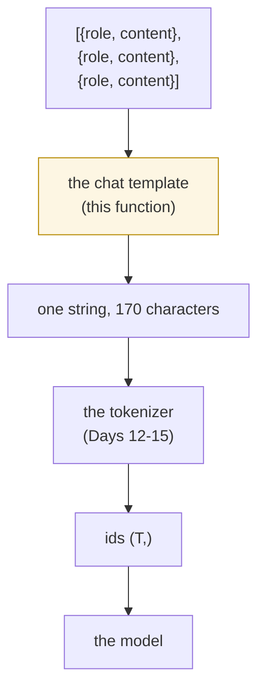

# 4.1 — A list of messages becomes one string

## One-line answer

A model has no idea what a "conversation" is — it reads one flat sequence of ids — so somewhere between your
list of `{"role": ..., "content": ...}` dictionaries and the tokenizer there is a function that flattens
them into a single string, and **that function is the chat template**.

---

## The story

A family keeps a paper notebook by the landline for phone messages.

Each entry is written the same way, without anyone ever having agreed it: a line with who called, then the
message underneath, then a line across the page before the next one. *Aunt, 4 p.m.* — *the parcel arrived* —
line. *School office* — *sports day moved to Friday* — line.

Anyone in the house can read the notebook and know who said what, and the notebook is one continuous page of
handwriting. There is no structure in it. There is only a habit, followed consistently enough that the
structure can be recovered by eye.

The habit is doing all the work. On the day somebody writes a message without the line across the page, two
calls become one, and the aunt appears to have said something about sports day.

---

## The idea in plain language

Every day so far has fed the tokenizer a **string** and got back a **list of ids**. Day 9 part
[2.2](../../../day-009-the-vocabulary-problem/parts/02-what-a-tokenizer-is/2.2-where-the-tokenizer-sits.md)
placed the tokenizer in the stack: text on one side, ids on the other, model beyond that.

But an application does not have a string. It has a conversation — a list of turns, each with a speaker and
some text:

```
[{"role": "system",    "content": "You answer in one sentence."},
 {"role": "user",      "content": "What is a merge list?"},
 {"role": "assistant", "content": "An ordered table of byte pairs."}]
```

Three dictionaries. The model cannot read a dictionary. It cannot read a list. It reads a `(T,)` vector of
integers, and every one of those integers came from a character in a single flat string.

So something has to turn the list into that string. That something is a **chat template**, and it is
entirely a matter of convention:

- it decides what marks the start of a turn,
- it decides how the role name is written and where,
- it decides what marks the end of a turn,
- it decides what, if anything, is added to invite the model to speak next.

**There is no correct answer to any of those four.** Different model families make different choices, and a
model is trained with exactly one of them. What makes a template right is not its design; it is that the
template used at inference is **the same one** used in training. That is the entire content of Silent
Failure #2 (plan §6), and section [05](../05-template-mismatch/5.1-one-character-three-tokens-a-different-model.md)
measures what a one-character disagreement costs.

**Why "roles as tokens" is the phrase to remember.** A role is not a field the model receives. It is text —
literally the letters `s`, `y`, `s`, `t`, `e`, `m` — sitting inside the same stream as the message content,
distinguished from content only by the markers around it. The model learns what a role means the way it
learns what any other pattern means: by seeing it in the same position a great many times. Part
[4.3](4.3-the-generation-prompt.md) measures the surprising consequence of that: `assistant` is not one
token.

---

## Why Akshara needs it

Day 88 fine-tunes Akshara on conversations, and the first thing that script does is flatten a dataset of
message lists into strings. Day 150 serves the model over HTTP, and the first thing *that* handler does is
flatten an incoming request's message list into a string.

Those are two files, written on two different days, and if they flatten differently the model is served
input it never saw in training. Nothing errors. The model still answers.

That is why the template belongs on Day 16 rather than on Day 88: it is a **property of the tokenizer**, to
be written once, saved beside the vocabulary, and loaded by both scripts. Part
[4.4](4.4-the-same-template-as-a-template.md) is where it stops being a Python function and becomes a
serializable object, which is what makes "written once" enforceable rather than hopeful.

---

## The mechanism

The flattening, with nothing clever in it:

```python
# lab/chat_01.py  -  T0, laptop CPU. No dependencies.
chat = [
    {"role": "system", "content": "You answer in one sentence."},
    {"role": "user", "content": "What is a merge list?"},
    {"role": "assistant", "content": "An ordered table of byte pairs."},
]

for m in chat:
    print(f"{m['role']:>9} | {m['content']}")

flat = "".join(
    "<|im_start|>" + m["role"] + "\n" + m["content"] + "<|im_end|>" + "\n" for m in chat
)
print()
print("characters:", len(flat))
print(repr(flat))
```

**Line by line:**

- `chat` is a list of dictionaries with exactly two keys. That shape is a convention, not a standard, and
  every part of this section takes it as given; a message carrying a name, a timestamp or a tool call is the
  same idea with more keys, and the template is what decides whether those keys reach the model at all.
- The `for` loop printing the roles exists only to make the *input* structure visible before the output
  string. A reader who cannot see the three separate objects will not appreciate that they became one.
- The join concatenates four pieces per message — marker, role, newline, content — and then a closing marker
  and a newline. Each piece is written separately rather than as one f-string, because every one of those
  four is a decision, and section
  [05](../05-template-mismatch/5.1-one-character-three-tokens-a-different-model.md) changes exactly one of
  them.
- `"\n"` after the role and `"\n"` after `<|im_end|>` are **two different newlines** doing two different
  jobs: the first separates the role from its content, the second separates one turn from the next. They
  look identical in the output and they are not interchangeable.
- `repr(flat)` rather than `print(flat)`. Printed raw, the newlines become line breaks and the string looks
  like a nicely formatted transcript, which hides the fact that it is one line of text as far as the
  tokenizer is concerned.

Measured on this machine, 2026-08-29:

```text
   system | You answer in one sentence.
     user | What is a merge list?
assistant | An ordered table of byte pairs.

characters: 170
'<|im_start|>system\nYou answer in one sentence.<|im_end|>\n<|im_start|>user\nWhat is a merge list?<|im_end|>\n<|im_start|>assistant\nAn ordered table of byte pairs.<|im_end|>\n'
```

Three dictionaries in, one 170-character string out. Every `\n` in that output is a literal newline
character in the string, not a line break in the display — which is exactly what the notebook in the story
looks like: one continuous page whose structure is a habit.



The highlighted box is the only new stage. Everything to its right is what the last seven days built, and
everything to its left is application code. The template is the seam, and a seam is where things come apart.

---

## When it breaks

**The loud version.** A message missing a key:

```text
Traceback (most recent call last):
  File "chat_01.py", line 12, in <genexpr>
    "<|im_start|>" + m["role"] + "\n" + m["content"] + "<|im_end|>" + "\n" for m in chat
                                        ~^^^^^^^^^^^
KeyError: 'content'
```

Welcome and cheap. A tool-call message with a `function` key instead of `content` produces exactly this, and
it produces it at the first request rather than after a deploy.

**The silent version.** Flatten with the turns in the wrong order, or with one turn missing, and you get a
perfectly valid string:

```text
'<|im_start|>user\nWhat is a merge list?<|im_end|>\n<|im_start|>system\nYou answer in one sentence.<|im_end|>\n'
```

The system message is now *after* the user's question. The model reads a conversation in which the
instructions arrive too late to have shaped the answer, and it will still answer — slightly worse, on some
questions, in a way that no test catches and that looks like model quality.

**The other silent version, and it is the one that will actually happen to you.** Flatten with the same
markers but a different separator — a space instead of a newline after the role — and the string is still
valid, still readable, still round-trips. Part
[5.1](../05-template-mismatch/5.1-one-character-three-tokens-a-different-model.md) measures that case in ids
rather than in characters, which is where the damage becomes visible.

**The check that catches the structural faults,** and it can go red:

```python
ROLES = {"system", "user", "assistant"}
assert chat, "empty conversation - the template would produce an empty string"
for i, m in enumerate(chat):
    assert set(m) >= {"role", "content"}, f"message {i} has keys {sorted(m)}"
    assert m["role"] in ROLES, f"message {i} has unknown role {m['role']!r}; known: {sorted(ROLES)}"
    assert isinstance(m["content"], str), f"message {i} content is {type(m['content']).__name__}"
assert sum(m["role"] == "system" for m in chat) <= 1, "more than one system message"
if any(m["role"] == "system" for m in chat):
    assert chat[0]["role"] == "system", "there is a system message and it is not first"
print(f"{len(chat)} messages, roles: {[m['role'] for m in chat]}")
```

**Line by line:**

- `set(m) >= {"role", "content"}` is a superset test, not equality. Extra keys are normal — a name, an id, a
  tool call — and a template that rejects them is a template that breaks the first time the application
  grows a feature. What must be present is checked; what else is there is not this check's business.
- `m["role"] in ROLES` catches the typo that produces the worst possible failure: a role of `"User"` renders
  as the literal text `User`, which the model has never seen in that position, and it degrades quietly.
- `isinstance(m["content"], str)` catches a `None` content, which concatenates into `TypeError` a line later
  with a much less helpful message. Checking the type at the boundary is the difference between naming the
  message index and naming a line in a generator expression.
- The last two assertions encode an **ordering** convention rather than a syntactic one. They are the kind
  of rule that lives in a template's documentation and nowhere in its code — and section
  [4.5](4.5-a-published-template-read-line-by-line.md) reads a published template that enforces exactly this
  rule inside itself, which is the better place for it.

---

## In production

**The template ships with the tokenizer, not with the application.** That is the single most important
practice in this section. Part [4.5](4.5-a-published-template-read-line-by-line.md) reads a real
`tokenizer_config.json` with a `chat_template` field inside it: the flattening rule travels in the same file
as the vocabulary, downloaded together, versioned together, and impossible to load one without the other.

**What a research engineer does before fine-tuning on someone else's model.** Renders one example through
the model's own template and prints it with `repr`, before writing any training code. Two minutes, and it
answers the four questions above — turn marker, role placement, end marker, generation prompt — from the
artifact rather than from a blog post. Then that rendered string is what the training data is built from.

**What degrades at scale.** Nothing about this operation is expensive; it is string concatenation. What
degrades is *drift*. A codebase accumulates a second flattening function — in a test fixture, in an
evaluation harness, in a batch-scoring job — and the copies diverge one small edit at a time. The defence is
that there is one function and it is loaded from the tokenizer, so a second copy has to be written
deliberately rather than by accident.

**The failure that only shows with real data.** A user's message containing the marker text. That is part
[2.3](../02-attaching-them/2.3-the-library-that-did-not-raise.md), and it is worth re-reading now that the
markers have a job: the flattening step is precisely where user content and system structure enter the same
string, so it is precisely where the trust boundary has to be enforced.

**The interview question:** *"How does a chat model know who said what?"* The answer that shows understanding
is "it does not — it reads one flat string, and the roles are text inside it, marked by tokens the model
learned during training." Anyone answering in terms of the model "receiving a list of messages" has only
ever used an API.

---

## Check yourself

Run this — it prints a character count and a marker count, not a pass:

```text
uv run python -c "
chat = [
  {'role': 'system',    'content': 'You answer in one sentence.'},
  {'role': 'user',      'content': 'What is a merge list?'},
  {'role': 'assistant', 'content': 'An ordered table of byte pairs.'},
]
flat = ''.join('<|im_start|>' + m['role'] + chr(10) + m['content'] + '<|im_end|>' + chr(10) for m in chat)
print('messages  :', len(chat))
print('characters:', len(flat))
print('turn marks:', flat.count('<|im_start|>'), flat.count('<|im_end|>'))
print('newlines  :', flat.count(chr(10)))
print(repr(flat))
"
```

Expected: `3` messages, `170` characters, `3` and `3` markers, and `6` newlines — two per turn, which is the
thing worth noticing.

Then answer out loud, without scrolling up:

1. The model reads a `(T,)` vector of integers. Say where the word "role" is, physically, in that vector.
2. Name the four decisions a chat template makes. For each one, say what happens if training and serving
   disagree about it.
3. Six newlines for three messages. What are the two jobs they are doing, and why are they not
   interchangeable?
4. Why does the template belong in `tokenizer_config.json` rather than in the application?
