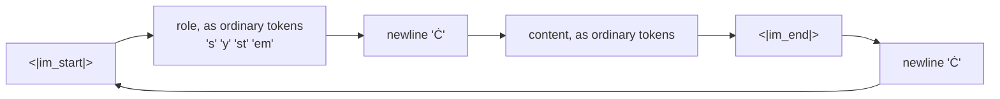

# 4.2 — Roles as markers, built by hand

## One-line answer

Register `<|im_start|>` and `<|im_end|>` as special tokens and the three-message conversation becomes **55
ids**, of which **6 are turn markers** — one id each, exactly as part 1.2 required — while the role names
themselves stay ordinary text, and the whole template is a nine-line Python function you write before you
open any library.

---

## The story

A community hall has a whiteboard by the door for the day's bookings.

Somebody worked out the format years ago and it has never changed: a horizontal line, then the group's name
on its own line, then what they need underneath, then another horizontal line. *Line. Yoga class. Mats from
the cupboard, 6 chairs. Line.*

New volunteers are not taught the format. They read the board, see three entries written that way, and write
the fourth the same way. The format survives because it is visible in its own output.

The horizontal lines are doing the work. Without them the board is a paragraph, and *yoga class* looks like
part of whatever the entry above asked for.

---

## The idea in plain language

Part [4.1](4.1-a-list-becomes-one-string.md) produced a flat string with `<|im_start|>` and `<|im_end|>` in
it. Those were just characters. This part makes them **tokens**, using everything section
[01](../01-special-tokens/1.1-four-jobs-four-tokens.md) built.

The name of the format is **ChatML** — a convention, not a standard, in which a turn is written as:

```
<|im_start|>ROLE
CONTENT<|im_end|>
```

Read the four pieces against the four decisions part [4.1](4.1-a-list-becomes-one-string.md) listed:

| Decision | ChatML's answer |
| --- | --- |
| what marks the start of a turn | the token `<\|im_start\|>` |
| how the role is written | as **ordinary text**, immediately after the start marker, then a newline |
| what marks the end of a turn | the token `<\|im_end\|>`, then a newline |
| what invites the model to speak | an opened turn with no content — part [4.3](4.3-the-generation-prompt.md) |

**The second row is the one that surprises people.** `system`, `user` and `assistant` are not special
tokens. They are spelled out, letter by letter, in the ordinary vocabulary, and the tokenizer splits them
the way it splits any other word. Part [4.3](4.3-the-generation-prompt.md) measures what `assistant` costs.

That is a deliberate design, and the argument for it is extensibility: a format whose roles are ordinary
text can add a role — `tool`, `function`, `observation` — without touching the vocabulary, without resizing
an embedding (section [03](../03-the-embedding-matrix/3.1-one-row-per-id.md)) and without retraining. The
cost is a handful of tokens per turn and the fact that a user can *type* a role name.

**Why the markers must be single tokens** is part [1.2](../01-special-tokens/1.2-a-special-token-has-to-be-one-token.md)'s
entire argument, arriving with a job to do. A turn boundary spread over nine ordinary tokens is a phrase; a
turn boundary that is one id is a symbol. The model has to learn "this position ends a turn", and learning
that about one id is a far easier problem than learning it about a nine-token conjunction whose pieces —
`im`, `st`, `ar`, `t` — all occur in ordinary prose.

---

## Why Akshara needs it

Principle 3: build first, compare after. Part [4.4](4.4-the-same-template-as-a-template.md) opens Jinja2 —
the engine that renders every published chat template — and part
[4.5](4.5-a-published-template-read-line-by-line.md) reads a real one off a model card. Neither of those
documents teaches you what a chat template *is*; they teach you how the industry writes one down.

This document is the version you write yourself, in nine lines, with no dependency, so that when the Jinja2
version arrives you are diffing your understanding against theirs rather than importing a mystery. And the
diff is the point: part [4.4](4.4-the-same-template-as-a-template.md) asserts the two produce
**byte-identical** output, which is a claim you can only make if you built one of them.

---

## The mechanism

```python
# lab/chat_02.py  -  T0, laptop CPU. Uses fresh() from lab/specials_04.py.
tok = fresh()
tok.add_special_tokens(["<|pad|>", "<|im_start|>", "<|im_end|>"])
for t in ("<|pad|>", "<|im_start|>", "<|im_end|>"):
    print(f"  {t:14s} -> id {tok.token_to_id(t)}")

chat = [
    {"role": "system", "content": "You answer in one sentence."},
    {"role": "user", "content": "What is a merge list?"},
    {"role": "assistant", "content": "An ordered table of byte pairs."},
]


def render_by_hand(messages: list[dict[str, str]]) -> str:
    """Flatten a conversation into one ChatML string. The whole template, by hand."""
    out = []
    for m in messages:
        out.append("<|im_start|>" + m["role"] + "\n" + m["content"] + "<|im_end|>" + "\n")
    return "".join(out)


s = render_by_hand(chat)
enc = tok.encode(s)
start, end = tok.token_to_id("<|im_start|>"), tok.token_to_id("<|im_end|>")

print("characters :", len(s))
print("ids        :", len(enc.ids))
print("turn marks :", enc.ids.count(start), "starts,", enc.ids.count(end), "ends")
print("first 8    :", enc.tokens[:8])
print("round-trips:", tok.decode(enc.ids, skip_special_tokens=False) == s)
```

**Line by line:**

- `add_special_tokens` registers **three** tokens, not two: `<|pad|>` goes in first so that the two markers
  land on ids 1001 and 1002 rather than 1000 and 1001. That is not cosmetic — part
  [2.2](../02-attaching-them/2.2-the-pad-token-that-is-also-the-end-token.md) argued that pad and eos
  sharing an id is a decision, and putting pad first makes it a *visible* decision rather than an accident
  of ordering.
- `render_by_hand` builds a list and joins it, rather than concatenating onto a string in a loop. On three
  messages this is irrelevant; on a dataset of a million conversations, repeated string concatenation is
  quadratic and the join is not. It costs nothing to write the fast one.
- The `+` chain spells out all five pieces on one line. An f-string would read better and hide the seams,
  and the seams are the subject: part [5.1](../05-template-mismatch/5.1-one-character-three-tokens-a-different-model.md)
  moves exactly one of these `"\n"`s.
- `enc.ids.count(start)` counts **ids**, not occurrences of the string. Day 15 part
  [2.1](../../../day-015-wordpiece-unigram-sentencepiece/parts/02-unigram/2.1-start-big-and-prune.md)
  established that a token *string* can lie and only the id is truthful; counting the substring in `s` would
  tell you what you wrote, and counting the id tells you what the model gets.
- The round-trip assertion uses `skip_special_tokens=False`, for the reason part
  [1.4](../01-special-tokens/1.4-special-means-decode-drops-it.md) measured: with the default the markers
  vanish and the comparison fails for a reason that has nothing to do with the template.

Measured on this machine, 2026-08-29, corpus sha256 `9760f2b6d4340b97`:

```text
  <|pad|>        -> id 1000
  <|im_start|>   -> id 1001
  <|im_end|>     -> id 1002
characters : 170
ids        : 55
turn marks : 3 starts, 3 ends
first 8    : ['<|im_start|>', 's', 'y', 'stem', 'Ċ', 'Y', 'ou', 'Ġans']
round-trips: True
```

170 characters become 55 ids. Six of those are turn markers — three starts, three ends — one id each,
exactly as required.

**Now read `first 8` carefully, because it contains the whole point of the "roles as text" design.** After
the single marker token comes `'s'`, `'y'`, `'stem'` — the word `system`, in **three ordinary tokens**, none
of them special. Then `'Ċ'`, which is the byte-level tokenizer's spelling of a newline (Day 13 part
[3.2](../../../day-013-bpe-encode-decode-bytes/parts/03-byte-level-bpe/3.2-the-byte-to-unicode-trick.md)
explains why a newline is drawn that way). The structure of a turn is one special token followed by
completely ordinary text.



The loop closes: the newline after one turn's end marker leads straight into the next turn's start marker.
That cycle, repeated, is the entire format.

---

## Shapes

| Tensor | Symbolic shape | Concrete here | What each axis means |
| --- | --- | --- | --- |
| the rendered string | — | 170 characters | not a tensor; the last point at which this is text |
| `ids` | `(T,)` | `(55,)` | position in the flattened conversation → a token id |
| the turn-marker positions | — | 6 of 55 | 3 `<\|im_start\|>` at ids 1001, 3 `<\|im_end\|>` at 1002 |
| `ids`, embedded | `(T, C)` | `(55, 384)` | one row per position, from the table in part [3.1](../03-the-embedding-matrix/3.1-one-row-per-id.md) |
| a batch of conversations | `(B, T)` | `(B, 55)` | padded to the longest, as in part [2.2](../02-attaching-them/2.2-the-pad-token-that-is-also-the-end-token.md) |

The number to keep an eye on is `T = 55` for a three-turn conversation of 170 characters. Structural overhead
— the six markers plus the role names and their newlines — is a fixed cost per turn, and part
[4.3](4.3-the-generation-prompt.md) measures it exactly. On a long conversation it is the difference between
fitting in a context window and not.

---

## When it breaks

**The loud version.** Render before registering the markers, and every assertion about ids fails at once:

```text
>>> enc.ids.count(tok.token_to_id("<|im_start|>"))
Traceback (most recent call last):
  File "<stdin>", line 1, in <module>
TypeError: 'NoneType' object cannot be interpreted as an integer
```

Same message as part [1.1](../01-special-tokens/1.1-four-jobs-four-tokens.md)'s, from `list.count` instead of
`decode`, and it means the same thing: the token is not registered, so `token_to_id` gave you `None`.

**The silent version.** Render *without* registering the markers and never count ids, and everything works:

```text
characters : 170
ids        : 97
turn marks : 0 starts, 0 ends
first 8    : ['<', '|', 'im', '_', 'st', 'ar', 't', '|']
round-trips: True
```

55 ids became **97** — a 76.4% increase — because `<|im_start|>` is now **9** ordinary tokens and
`<|im_end|>` is **7**, instead of one each. The string is identical. The round-trip passes. The conversation is perfectly readable. And the model is being
asked to learn turn boundaries as a seven-token phrase whose pieces (`im`, `start`, `|`) all occur in
ordinary text.

**The check that catches it,** and it can go red:

```python
start, end = tok.token_to_id("<|im_start|>"), tok.token_to_id("<|im_end|>")
assert start is not None and end is not None, "markers are not registered special tokens"
assert len(tok.encode("<|im_start|>").ids) == 1, "the start marker is not atomic"
assert len(tok.encode("<|im_end|>").ids) == 1, "the end marker is not atomic"

ids = tok.encode(render_by_hand(chat)).ids
assert ids.count(start) == len(chat), f"{ids.count(start)} start markers for {len(chat)} messages"
assert ids.count(end) == len(chat), f"{ids.count(end)} end markers for {len(chat)} messages"
assert ids[0] == start, "the rendered conversation does not begin with a turn marker"
print(f"{len(chat)} messages -> {len(ids)} ids, {ids.count(start)} turns")
```

**Line by line:**

- The atomicity assertions repeat part [1.2](../01-special-tokens/1.2-a-special-token-has-to-be-one-token.md)'s
  check, and repeating it here is right rather than redundant: this is the file where the markers acquire a
  job, so this is where the property they need has to hold.
- `ids.count(start) == len(chat)` ties the id count to the **input**, not to a literal `3`. A test that
  hardcodes 3 stops testing anything the moment somebody adds a fourth message to the fixture.
- `ids[0] == start` catches a rendering that has picked up a leading space or a stray prefix, which is
  exactly what Day 14 part
  [3.3](../../../day-014-tiktoken-and-the-pipeline/parts/03-the-remaining-gap/3.3-the-mismatch-the-library-will-not-catch.md)
  measured from `add_prefix_space`. One id at position zero is a cheap thing to pin and an expensive thing
  to get wrong.
- There is deliberately **no** assertion on the total id count. 55 depends on the vocabulary, and pinning it
  would make this test fail every time the trainer's `vocab_size` changed — a test that breaks for reasons
  unrelated to its subject teaches people to delete tests.

---

## In production

**Roles as ordinary text is why tool calling was addable.** Formats that shipped with `system`, `user` and
`assistant` as *special tokens* had a fixed role set baked into the vocabulary; adding `tool` meant a
vocabulary change, an embedding resize (section
[03](../03-the-embedding-matrix/3.2-growing-the-table.md)) and retraining. Formats that spelled roles out in
ordinary text added the role by changing a string. That is the extensibility argument, and it played out
over real model generations.

**The cost is real and it is per turn.** Part [4.3](4.3-the-generation-prompt.md) measures it. On a
20-turn support conversation the structural tokens are paid twenty times, out of the same context window
that the actual conversation needs.

**What a research engineer writes instead of `render_by_hand`.** They do not write it at all — they load the
template from the tokenizer, which is part [4.4](4.4-the-same-template-as-a-template.md). A hand-rolled
renderer in application code is a second copy of a rule that already exists in a file, and part
[5.1](../05-template-mismatch/5.1-one-character-three-tokens-a-different-model.md) is what happens to second
copies.

**The failure that only shows with real data.** A conversation where the content itself contains a newline
followed by something that looks like a role. The model has learned that `\n` after `<|im_start|>` separates
a role from content, and content is free to contain both. This is the same trust-boundary problem as part
[2.3](../02-attaching-them/2.3-the-library-that-did-not-raise.md), one level up: the markers are protected
by tokenization, and the *role names* are not protected by anything.

**The review comment:** *"Is `<|im_start|>` one token in this tokenizer?"* One line to check, and it is the
difference between 55 ids and 97.

**The interview question:** *"In ChatML, is `user` a special token?"* The answer is no, and the reason is the
interesting half: keeping roles as ordinary text means the role set can grow without a vocabulary change.
Anybody who has only read about chat templates says yes.

---

## Check yourself

Run this — it prints an id count and a marker count, not a pass:

```text
uv run python -c "
from tokenizers import Tokenizer, models, pre_tokenizers, decoders, trainers
import pathlib
t = Tokenizer(models.BPE()); t.pre_tokenizer = pre_tokenizers.ByteLevel(add_prefix_space=False)
t.decoder = decoders.ByteLevel()
t.train_from_iterator([pathlib.Path('docs/00_MASTER_PLAN.md').read_text(encoding='utf-8')],
  trainer=trainers.BpeTrainer(vocab_size=1000, show_progress=False,
                              initial_alphabet=pre_tokenizers.ByteLevel.alphabet()))
chat = [
  {'role': 'system',    'content': 'You answer in one sentence.'},
  {'role': 'user',      'content': 'What is a merge list?'},
  {'role': 'assistant', 'content': 'An ordered table of byte pairs.'},
]
r = lambda ms: ''.join('<|im_start|>'+m['role']+chr(10)+m['content']+'<|im_end|>'+chr(10) for m in ms)
s = r(chat)
print('unregistered:', len(t.encode(s).ids), 'ids')
t.add_special_tokens(['<|pad|>','<|im_start|>','<|im_end|>'])
enc = t.encode(s)
st, en = t.token_to_id('<|im_start|>'), t.token_to_id('<|im_end|>')
print('registered  :', len(enc.ids), 'ids,', enc.ids.count(st), 'starts,', enc.ids.count(en), 'ends')
print('first 8     :', enc.tokens[:8])
"
```

Expected: `97 ids` unregistered, then `55 ids, 3 starts, 3 ends`, and a first-8 list whose second, third
and fourth entries spell `system` in ordinary pieces.

Then answer out loud, without scrolling up:

1. Which parts of a ChatML turn are special tokens and which are ordinary text? Say why the split is where
   it is.
2. Unregistered markers cost 97 ids instead of 55, and nothing errors. Name two separate things that go
   wrong downstream.
3. The check block asserts marker counts but deliberately does not assert `len(ids) == 55`. Say why.
4. What did keeping roles as ordinary text make possible later? Give a concrete example.
