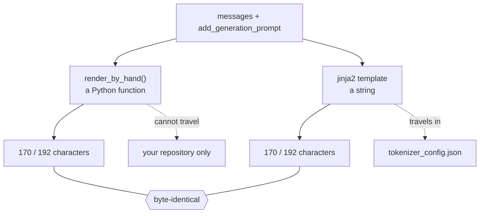

# 4.4 — 🔍 The same template, as a template

## One-line answer

Rewrite part 4.2's nine-line Python function as a Jinja2 template string and the two produce
**byte-identical** output in both modes — measured here, `hand == jinja` is `True` with and without the
generation prompt — which is the point: the template becomes a **string**, and a string can travel inside
`tokenizer_config.json` where a function cannot.

---

## The story

A tea stall has a regular order for the office next door: four cups, two without sugar, one extra strong,
delivered at eleven.

For two years the person who runs the stall simply remembers it. It works perfectly. It is also entirely
inside one head, so on the morning that person is away, the order does not arrive, and the relief cannot be
told what to do over the phone in less time than it takes to get it wrong.

Then somebody writes it on a card and pins it up. Nothing about the order changes. What changes is that the
order is now an object — it can be copied, corrected, carried next door, and checked against what actually
turned up.

---

## The idea in plain language

Part [4.2](4.2-roles-as-markers.md) built the template as a Python function, and part
[4.3](4.3-the-generation-prompt.md) gave it a flag. That function is correct and it is also **stuck**: it
lives in a `.py` file, in one repository, and every other program that needs to render a conversation for
this model has to import it or reimplement it.

Principle 3 says build first, compare after. The hand-rolled version exists. Now open the library.

**Jinja2** is a text-templating engine: a small language in which a *string* describes how to build another
string from some data. Its markers are two:

| Syntax | Means |
| --- | --- |
| `{{ expression }}` | insert the value of this expression here |
| `` | control flow — `for`, `if`, `endfor`, `endif` |

Everything outside those markers is copied out literally. So part 4.2's function becomes:

```
<|im_start|>{{ m['role'] }}
{{ m['content'] }}<|im_end|>
<|im_start|>assistant

```

Read it against the function and it is line-for-line the same thing: loop over the messages, emit a marker,
the role, a newline, the content, the end marker, a newline; then, conditionally, the generation prompt.

**Why this matters is not elegance.** A Jinja2 template is a **string**, and a string can be:

- stored in `tokenizer_config.json` next to the vocabulary and the special tokens (part
  [4.5](4.5-a-published-template-read-line-by-line.md) reads a real one),
- downloaded with the model by anyone, in any language, without your repository,
- hashed, so two systems can prove they are using the same one (part
  [5.2](../05-template-mismatch/5.2-the-check-the-round-trip-cannot-make.md)).

None of those are true of a Python function. That is the whole argument, and it is an argument about
distribution rather than about programming.

**What the library does that your function does not.** Three things, and they are all about *other people's*
templates rather than your own: it evaluates conditionals over the message list, so a template can inject a
default system message or refuse a malformed conversation (part
[4.5](4.5-a-published-template-read-line-by-line.md) has an example of the first); it exposes loop
variables like `loop.first` and `loop.last`, which real templates use constantly; and it fails loudly on an
undefined variable when configured to, which a hand-rolled `.get()` chain silently would not. You do not
need any of the three for the template above. You need all three to *read* the template a model ships with.

---

## Why Akshara needs it

Day 88's fine-tune and Day 150's server both render conversations, and part
[4.1](4.1-a-list-becomes-one-string.md) argued they must render them identically. A shared Python function
achieves that only while both live in this repository.

The moment Akshara is downloaded by anybody — or evaluated by a harness written on Day 112, or served by a
runtime written on Day 152 — the rendering rule has to travel *in the model's own files*. Jinja2 is how the
field solved that, and part [5.2](../05-template-mismatch/5.2-the-check-the-round-trip-cannot-make.md) is
the check that makes the travelling copy verifiable.

---

## The mechanism

Both renderers, on the same data, asserted equal.

```python
# lab/chat_04.py  -  T0, laptop CPU. Requires jinja2==3.1.6 (see the hub's §3).
import jinja2

print("jinja2", jinja2.__version__)

TEMPLATE = (
    ""
    "<|im_start|>{{ m['role'] }}\n{{ m['content'] }}<|im_end|>\n"
    ""
    "<|im_start|>assistant\n"
)

env = jinja2.Environment(undefined=jinja2.StrictUndefined)
jt = env.from_string(TEMPLATE)

for agp in (False, True):
    a = render_by_hand(chat, add_generation_prompt=agp)
    b = jt.render(messages=chat, add_generation_prompt=agp)
    print(f"add_generation_prompt={agp}: hand == jinja -> {a == b}")
    print("  characters:", len(b), " ids:", len(tok.encode(b).ids))
    assert a == b, f"renderers disagree:\n  hand : {a!r}\n  jinja: {b!r}"
```

**Line by line:**

- `jinja2.__version__` is printed rather than assumed. Principle 6: the version is observed on the day it is
  used, and the hub's §8 records that this document was written against **3.1.6**, resolved live from PyPI
  on 2026-08-29.
- `TEMPLATE` is built by concatenating four adjacent string literals, so each clause of the template sits on
  its own source line. Written as one long string it would be unreadable, and written as a triple-quoted
  block it would acquire indentation and newlines that the template does not want — which is a real and very
  common Jinja2 bug.
- `undefined=jinja2.StrictUndefined` makes a reference to a variable you did not pass **raise** instead of
  rendering as the empty string. That is the single most important argument in this file: with the default,
  a typo like `{{ m['contnet'] }}` renders every message as empty and produces a perfectly well-formed,
  entirely contentless conversation.
- `env.from_string(TEMPLATE)` compiles the template once, outside the loop. Compilation is the expensive
  part; rendering is cheap. On a training set of a million conversations this is the difference between
  compiling once and compiling a million times.
- `jt.render(messages=chat, add_generation_prompt=agp)` passes the data by **keyword**, and those keyword
  names are what the template's `{{ }}` expressions refer to. Rename `messages` here and the template breaks
  — which, with `StrictUndefined`, it does loudly.
- The `assert` carries both strings in its message. When two renderers disagree the only useful information
  is *where*, and two `repr`s one above the other let you find it by eye in a second.

Measured on this machine, 2026-08-29, `jinja2` 3.1.6:

```text
jinja2 3.1.6
add_generation_prompt=False: hand == jinja -> True
  characters: 170  ids: 55
add_generation_prompt=True: hand == jinja -> True
  characters: 192  ids: 60
```

Byte-identical, in both modes, to the character and to the id. The nine-line function and the
four-line string are the same function written twice — which is exactly what Principle 3 asks for: the
library is now a convenience whose behaviour you can predict, rather than a mystery with a nice API.



---

## When it breaks

**The loud version, and it is the one you have configured for.** A typo in a variable name, with
`StrictUndefined`:

```text
Traceback (most recent call last):
  File "chat_04.py", line 19, in <module>
    b = jt.render(messages=chat, add_generation_prompt=agp)
jinja2.exceptions.UndefinedError: 'messages' is undefined
```

That is the exact message, measured on this machine on 2026-08-29 by rendering with the keyword misspelled.
It names the variable. It is everything you want.

**The silent version, which is the default.** Drop `undefined=jinja2.StrictUndefined` and the same mistake
renders instead of raising:

```text
>>> jinja2.Environment().from_string(TEMPLATE).render(msgs=chat, add_generation_prompt=True)
'<|im_start|>assistant\n'
```

Twenty-two characters. The entire conversation is gone — the `` iterated over an undefined value,
which Jinja2's default treats as empty — and what is left is a well-formed generation prompt with no
history. Sent to a model, that produces a fluent answer to nothing at all, and every downstream check
passes: it is valid ChatML, it tokenizes, it round-trips.

**The whitespace version, which is the one that will actually catch you.** Jinja2 has options named
`trim_blocks` and `lstrip_blocks` that change how newlines around `` tags are handled. This part uses
the defaults for both, and the template above is written so that no `` tag sits on its own line —
every one is immediately adjacent to the text around it. Write it across multiple source lines for
readability and the template acquires newlines that the hand-rolled function does not have, and the
`a == b` assertion fails. That failure is the check doing its job, and it is why the assertion is in the
loop rather than in a test file somebody may not run.

**The check that catches all of it,** and it can go red:

```python
for agp in (False, True):
    a = render_by_hand(chat, add_generation_prompt=agp)
    b = jt.render(messages=chat, add_generation_prompt=agp)
    assert a == b, f"agp={agp}: renderers disagree\n  hand : {a!r}\n  jinja: {b!r}"
    assert tok.encode(a).ids == tok.encode(b).ids, "same string, different ids - impossible; check the tokenizer"
assert jt.render(messages=[], add_generation_prompt=False) == "", "empty conversation is not empty"
try:
    env.from_string("{{ nope }}").render()
except jinja2.exceptions.UndefinedError:
    pass
else:
    raise AssertionError("StrictUndefined is not configured - a typo would render as empty")
print("hand and jinja agree on", len(chat), "messages, both modes")
```

**Line by line:**

- The id comparison after the string comparison looks redundant and is not quite: it pins the assumption
  that the tokenizer is deterministic. Day 15 part
  [2.4](../../../day-015-wordpiece-unigram-sentencepiece/parts/02-unigram/2.4-subword-regularization.md)
  measured a tokenizer that is *not* — subword regularization makes encoding random — so "same string
  implies same ids" is a property of this configuration, not of tokenizers in general, and it is cheap to
  state.
- The empty-conversation case is checked separately because it is the boundary, and boundaries are where
  template loops go wrong. A template that emits a stray newline on an empty list produces one bad training
  example per empty conversation in the dataset, which nobody notices.
- The `try/except/else` is the standard shape for asserting that something *does* raise. The `else` clause
  runs only when no exception occurred, which is the failure; writing it as a bare `try/except: pass` would
  pass silently when `StrictUndefined` was removed, which is the exact regression it exists to catch.

---

## In production

**What a research engineer actually does with this.** Never writes the template. Loads it from the
tokenizer, renders one example, and reads the output. Writing a chat template from scratch is something you
do once, for a model you are training yourself; reading one is something you do every time you touch
somebody else's model, and part [4.5](4.5-a-published-template-read-line-by-line.md) is that skill.

**Jinja2 is a real language, and templates use it.** Published templates contain conditionals on the first
message's role, loops with `loop.index`, string method calls, and occasionally logic that would be more at
home in Python. That is why the field standardised on a template engine rather than on a format string: the
rules genuinely are conditional. It also means a chat template is *code that runs on your input*, which is a
sentence worth sitting with when the template arrives from a model repository you did not audit.

**What degrades at scale.** Rendering is fast; **compiling** is not. `env.from_string` on every request, in
a server handling thousands per second, is a measurable cost for no benefit. Compile once at startup, render
per request. The code above already does this and the reason is worth naming rather than leaving as style.

**The review comment:** *"Is `StrictUndefined` set?"* One keyword argument, and it converts the worst failure
mode in this document — an entire conversation silently rendering as empty — into a traceback with the
variable's name in it.

**The interview question:** *"Why is a chat template written in Jinja rather than as a function?"* The answer
is distribution, and the strong form says it in one sentence: a template has to travel with the model, to
people who are not running your code, and a string travels where a function does not. A follow-up worth
volunteering is that this makes the template untrusted input, which is a property most people have not
considered.

---

## Check yourself

Run this — it prints two equality results and two id counts, not a pass:

```text
uv run python -c "
import jinja2, pathlib
from tokenizers import Tokenizer, models, pre_tokenizers, decoders, trainers
t = Tokenizer(models.BPE()); t.pre_tokenizer = pre_tokenizers.ByteLevel(add_prefix_space=False)
t.decoder = decoders.ByteLevel()
t.train_from_iterator([pathlib.Path('docs/00_MASTER_PLAN.md').read_text(encoding='utf-8')],
  trainer=trainers.BpeTrainer(vocab_size=1000, show_progress=False,
                              initial_alphabet=pre_tokenizers.ByteLevel.alphabet()))
t.add_special_tokens(['<|pad|>','<|im_start|>','<|im_end|>'])
chat = [
  {'role': 'system',    'content': 'You answer in one sentence.'},
  {'role': 'user',      'content': 'What is a merge list?'},
  {'role': 'assistant', 'content': 'An ordered table of byte pairs.'},
]
NL = chr(10)
def hand(ms, agp=False):
    o = ['<|im_start|>' + m['role'] + NL + m['content'] + '<|im_end|>' + NL for m in ms]
    if agp: o.append('<|im_start|>assistant' + NL)
    return ''.join(o)
TPL = ('<|im_start|>{{ m.role }}' + NL + '{{ m.content }}<|im_end|>' + NL
       + '<|im_start|>assistant' + NL + '')
jt = jinja2.Environment(undefined=jinja2.StrictUndefined).from_string(TPL)
print('jinja2', jinja2.__version__)
for agp in (False, True):
    a, b = hand(chat, agp), jt.render(messages=chat, add_generation_prompt=agp)
    print(f'agp={agp}: equal={a == b}, chars={len(b)}, ids={len(t.encode(b).ids)}')
"
```

Expected: `jinja2 3.1.6`, then `agp=False: equal=True, chars=170, ids=55` and
`agp=True: equal=True, chars=192, ids=60`.

Then answer out loud, without scrolling up:

1. Give the one real reason a chat template is a Jinja string rather than a Python function. It is not
   elegance.
2. Name three things the library does that your nine-line function does not, and say which of them you need
   for your *own* template.
3. Without `StrictUndefined`, a misspelled keyword renders 22 characters. Say what those 22 characters are
   and why every downstream check passes.
4. "A chat template is code that runs on your input." Say what follows from that, in one sentence.
