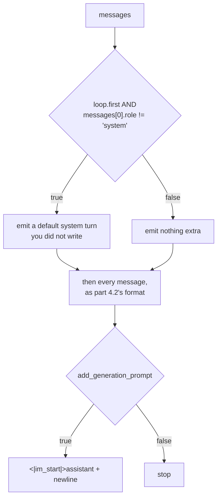

# 4.5 — A published template, read line by line

## One-line answer

A real `tokenizer_config.json`, pinned at revision `12fd25f7`, carries a chat template that is part 4.2's
format almost exactly — plus one conditional that **injects a default system message you did not write**, so
a one-message conversation of 21 characters renders as **three turns and 169 characters**.

---

## The story

You fill in a form at a bank counter with three boxes: name, account number, amount.

The clerk takes it, and before filing it writes a fourth line at the top that you never saw a box for — the
branch code — because every form filed from this counter needs one and the form does not ask.

Your form is now correct and it is not what you wrote. Nothing was hidden from you; you simply never looked
at the copy that went into the file. If you had, you would have found a line you did not put there, in
handwriting that is not yours, which is entirely routine and which will surprise you the first time you see
it.

---

## The idea in plain language

Everything in this section so far has been a template you wrote. This document reads one you did not.

The artifact is `tokenizer_config.json` from the model repository
`HuggingFaceTB/SmolLM2-135M-Instruct`, at revision `12fd25f77366fa6b3b4b768ec3050bf629380bac`, licence
Apache-2.0, recorded in `docs/MODELS.md` **before** it was read (Principle 13). It is a JSON file, not a
pickle, and it carries no weights — but the ledger row is written first regardless, because "it is only a
config" is exactly the sentence that precedes loading something you did not check.

The file is 3,764 bytes and its `chat_template` field is a Jinja2 string. Read against part
[4.4](4.4-the-same-template-as-a-template.md)'s template it is recognisably the same thing, with one clause
added, and reading that clause is the skill this part is for.

**Three facts to carry into it**, all measured in part
[2.2](../02-attaching-them/2.2-the-pad-token-that-is-also-the-end-token.md):

- `bos_token` is `<|im_start|>` and `eos_token` is `<|im_end|>` — **the BOS and EOS of this model are the
  chat markers**, not separate document markers.
- `pad_token` is also `<|im_end|>`, so pad and eos share id 2.
- There are 17 special tokens, at ids **0 to 16** — at the bottom of the number line, not the top, which is
  the opposite of what part [1.3](../01-special-tokens/1.3-added-tokens-sit-above-the-vocabulary.md)
  measured for a token added to a trained `tokenizers` vocabulary. Both conventions ship.

---

## Why Akshara needs it

Every day after Day 88 that touches a chat model starts by reading its template. Not a blog post about it,
not the model card's prose — the field in the config, rendered, with `repr` around the output.

The reason is the story: templates contain clauses you did not write and would not guess. A default system
message, a rule about the first turn's role, a tool-call block, a date stamp. If your training data is built
by your own renderer and the serving path uses the model's template, those clauses are a difference between
training and inference — which is Silent Failure #2, and section
[05](../05-template-mismatch/5.1-one-character-three-tokens-a-different-model.md) is what it costs.

---

## The mechanism

The template, verbatim, as the file carries it. Newlines inside the Jinja string literals are shown as real
line breaks, because that is what they are:

```text
{{ '<|im_start|>system
You are a helpful AI assistant named SmolLM, trained by Hugging Face<|im_end|>
' }}{{'<|im_start|>' + message['role'] + '
' + message['content'] + '<|im_end|>' + '
'}}{{ '<|im_start|>assistant
' }}
```

Now read it clause by clause.

**``** — the same loop as yours, with the variable named `message` rather than
`m`. Nothing to see, and it is worth confirming there is nothing to see.

**``** — this is the clause you did not write.
`loop.first` is a Jinja2 loop variable, true only on the first iteration; part
[4.4](4.4-the-same-template-as-a-template.md) listed loop variables as one of the three things the library
does that a hand-rolled function does not, and here is one being used. The condition reads: *on the first
message only, if the conversation does not already start with a system message…*

**`{{ '<|im_start|>system\nYou are a helpful AI assistant named SmolLM, trained by Hugging Face<|im_end|>\n' }}`**
— …then emit an entire system turn that the caller never supplied. That text is the model's own default,
quoted here exactly as the file carries it. Send this template a conversation with no system message and
one appears.

**`{{'<|im_start|>' + message['role'] + '\n' + message['content'] + '<|im_end|>' + '\n'}}`** — the turn
itself, and it is character-for-character part [4.2](4.2-roles-as-markers.md)'s function. Marker, role,
newline, content, end marker, newline. The hand-rolled version was not an approximation of the real thing;
it was the real thing.

**`{{ '<|im_start|>assistant\n' }}`** — part
[4.3](4.3-the-generation-prompt.md)'s generation prompt, identical, down to the trailing newline.

Now render it, twice, and watch the clause fire:

```python
# lab/chat_05.py  -  T0, laptop CPU. Requires jinja2==3.1.6.
import json
import pathlib

import jinja2

cfg = json.loads(pathlib.Path("lab/tokenizer_config.json").read_text(encoding="utf-8"))
jt = jinja2.Environment(undefined=jinja2.StrictUndefined).from_string(cfg["chat_template"])

no_system = [{"role": "user", "content": "What is a merge list?"}]
with_system = [
    {"role": "system", "content": "You answer in one sentence."},
    {"role": "user", "content": "What is a merge list?"},
]

for name, msgs in (("no system message", no_system), ("with system message", with_system)):
    out = jt.render(messages=msgs, add_generation_prompt=True)
    print(f"{name}: {len(msgs)} message(s) in, {len(out)} characters out")
    print("  turns rendered:", out.count("<|im_start|>"))
    print(" ", repr(out))
```

**Line by line:**

- The template comes out of `cfg["chat_template"]` — the file — rather than being retyped. Retyping it would
  be the one mistake this whole document warns against, and it would also be a claim about the file rather
  than a reading of it.
- `undefined=jinja2.StrictUndefined`, as in part [4.4](4.4-the-same-template-as-a-template.md). It matters
  more on somebody else's template than on your own, because you did not write the variable names it
  references and a mismatch between your message dictionaries and its expectations is otherwise silent. *When
  it breaks* below shows the traceback it buys you — and the case it still does not catch.
- The two message lists differ in **exactly one element**: whether a system message is present. That is the
  controlled comparison the conditional demands, and any other difference between them would muddy which
  clause fired.
- `out.count("<|im_start|>")` counts **turns** by counting start markers in the rendered string. Here the
  string is authored by the template, not by a user, so counting the substring is safe; part
  [2.3](../02-attaching-them/2.3-the-library-that-did-not-raise.md) is the case where it would not be.
- `repr(out)` for the same reason as everywhere else in this day: the injected system message ends in a
  newline, and printed raw it would look like a blank line.

Measured on this machine, 2026-08-29, `jinja2` 3.1.6, config sha256
`4ec77d44f62efeb38d7e044a1db318f6a939438425312dfa333b8382dbad98df`:

```text
no system message: 1 message(s) in, 169 characters out
  turns rendered: 3
  '<|im_start|>system\nYou are a helpful AI assistant named SmolLM, trained by Hugging Face<|im_end|>\n<|im_start|>user\nWhat is a merge list?<|im_end|>\n<|im_start|>assistant\n'
with system message: 2 message(s) in, 128 characters out
  turns rendered: 3
  '<|im_start|>system\nYou answer in one sentence.<|im_end|>\n<|im_start|>user\nWhat is a merge list?<|im_end|>\n<|im_start|>assistant\n'
```

**One message in. Three turns out.** A 21-character question became a 169-character prompt, most of it a
system message the caller never wrote and may not know exists. Supply your own system message and the clause
does not fire — two messages in, three turns out, 128 characters, and the injected default is gone.

That asymmetry is the practical lesson. The template's behaviour depends on the *shape* of your input, not
only its content. The injected turn is 98 characters long, and the two renders differ by 41 — because
supplying your own system message replaces the default rather than adding to it. Either way, something is
sitting in the system position on every request, and it is instructions that will influence every answer the
model gives.



---

## When it breaks

**The loud version.** Send a message that is missing a key:

```text
Traceback (most recent call last):
  File "chat_05.py", line 13, in <module>
    out = jt.render(messages=[{"role": "user"}], add_generation_prompt=True)
jinja2.exceptions.UndefinedError: 'dict object' has no attribute 'content'
```

That is the exact message, measured on this machine on 2026-08-29, and it exists **only because
`StrictUndefined` is set**. With Jinja2's default the same input renders the message as empty and produces a
well-formed conversation with a contentless user turn — which is part
[4.4](4.4-the-same-template-as-a-template.md)'s silent version arriving on somebody else's template.

**A second silent version, and it surprised this document.** Render with an empty message list:

```text
>>> jt.render(messages=[], add_generation_prompt=True)
'<|im_start|>assistant\n'
```

No error. The template guards `messages[0]['role']` behind `loop.first`, so on an empty list the loop body
never runs and the index is never evaluated — and what comes out is a bare generation prompt: an assistant
turn opened with no conversation at all behind it. The model is asked to speak with no context, and it will.
An empty message list is a caller bug that this template does not catch, so your handler has to.

**The silent version, and it is the reason this part exists.** Build your training set with your own
renderer — part [4.2](4.2-roles-as-markers.md)'s, which does not inject anything — and serve with the
model's template. Every conversation in training that lacked a system message had no system turn; every
request at serving time that lacks one gets 98 characters of instructions prepended.

Nothing errors. The strings are both valid ChatML. The model answers. It is simply being conditioned, at
inference, on a turn that never appeared in that position during training. The measurable difference:

```text
your renderer, no system message : 2 turns,  71 characters
model template, no system message: 3 turns, 169 characters
```

**The check that catches it,** and it can go red:

```python
mine = "".join(
    "<|im_start|>" + m["role"] + "\n" + m["content"] + "<|im_end|>" + "\n" for m in no_system
) + "<|im_start|>assistant\n"
theirs = jt.render(messages=no_system, add_generation_prompt=True)
assert mine == theirs, (
    "your renderer and the model's template disagree:\n"
    f"  yours : {len(mine):>4} chars, {mine.count('<|im_start|>')} turns\n"
    f"  theirs: {len(theirs):>4} chars, {theirs.count('<|im_start|>')} turns\n"
    "  build your training data with THEIR template, or your own model with YOUR template"
)
```

**Line by line:**

- The probe is the **no-system-message** conversation specifically, because that is the input shape that
  triggers the conditional. A probe set that always includes a system message would pass forever and prove
  nothing — which is the general trap with conditional templates, and the reason a probe set has to include
  the shapes that turn each clause on.
- The message reports **turns** as well as characters. A character-count difference could be a stray space;
  a turn-count difference is structural, and saying both tells the reader which kind of disagreement they
  have.
- The last line of the message is an instruction rather than a diagnosis, and it names both valid
  resolutions. This assertion is going to fire in somebody's data pipeline at an inconvenient moment, and
  what they need is the decision, not a lecture.
- This assertion is **expected to fail** on the model's template, as written. That is not a defect in the
  check — it is the check reporting a real disagreement, and part
  [5.2](../05-template-mismatch/5.2-the-check-the-round-trip-cannot-make.md) turns it into the form you
  would actually ship.

---

## In production

**Read the template before you write a line of training code.** One command, and it answers questions that
are otherwise guesses:

```text
uv run python -c "
import json, pathlib
d = json.loads(pathlib.Path('lab/tokenizer_config.json').read_text(encoding='utf-8'))
print(d['chat_template'])
"
```

**What to look for, in order.** Whether the template injects anything (a default system message, a date, a
tool preamble); whether it is conditional on the *shape* of the conversation; where the roles go; what the
generation prompt is, exactly, including trailing whitespace; and what happens to a role the template does
not know. Those five questions take five minutes and remove the single largest source of fine-tuning bugs.

**Templates are versioned with the model and they change.** The revision SHA in `docs/MODELS.md` is what
makes "the template we trained with" a checkable claim rather than a memory. `main` moves; a template edited
after your training run is a different model as far as your data pipeline is concerned, and pinning the
revision is the only thing standing between you and finding that out later.

**A template is code that runs on your input.** It is Jinja2, it comes from a repository you did not write,
and it evaluates expressions over data you supply. Rendering an untrusted template is a real trust decision.
Day 141's safety curriculum is where that gets its own treatment; the practice to start now is the same one
as for any downloaded artifact — pin the revision, record it, and read what you pinned.

**The interview question:** *"You fine-tuned on a chat dataset and the model behaves oddly at serving.
Where do you look first?"* Rendering one example through both paths and diffing the strings is a two-minute
check that finds this class of bug outright, and naming it as the *first* thing you would do — before
learning rate, before data quality — is what distinguishes somebody who has debugged this from somebody who
has read about it.

---

## Check yourself

Run this — it prints two character counts and two turn counts, not a pass:

```text
uv run python -c "
import json, pathlib, jinja2
d = json.loads(pathlib.Path('lab/tokenizer_config.json').read_text(encoding='utf-8'))
jt = jinja2.Environment(undefined=jinja2.StrictUndefined).from_string(d['chat_template'])
for name, msgs in (
  ('no system ', [{'role':'user','content':'What is a merge list?'}]),
  ('with system', [{'role':'system','content':'You answer in one sentence.'},
                   {'role':'user','content':'What is a merge list?'}]),
):
    out = jt.render(messages=msgs, add_generation_prompt=True)
    print(f'{name}: {len(msgs)} in -> {len(out):>4} chars, {out.count(chr(60)+chr(124)+\"im_start\"+chr(124)+chr(62))} turns')
print('bos/eos/pad:', d['bos_token'], d['eos_token'], d['pad_token'])
print('specials   :', len(d['added_tokens_decoder']), 'at ids', min(map(int, d['added_tokens_decoder'])), '-', max(map(int, d['added_tokens_decoder'])))
"
```

Expected: `1 in -> 169 chars, 3 turns`, `2 in -> 128 chars, 3 turns`, then `<|im_start|> <|im_end|>
<|im_end|>` and `17 at ids 0 - 16`.

Then answer out loud, without scrolling up:

1. One message went in and three turns came out. Name the clause responsible and the exact condition that
   fires it.
2. This model's BOS is `<|im_start|>`. Say what that means for a document that is not a conversation.
3. Your renderer and the model's template disagree by 98 characters on the same input, and nothing errors.
   Name the two valid resolutions.
4. Give the five questions to ask of any published template, in the order you would ask them.
