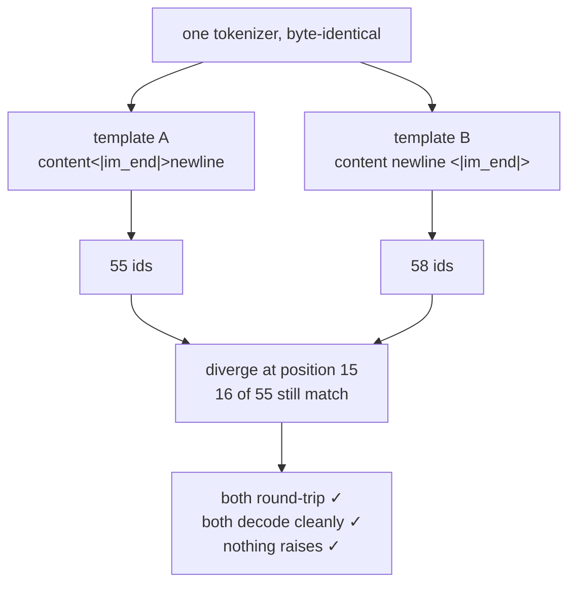

# 5.1 — 💥 One character, three tokens, a different model

## One-line answer

Add **one newline** to a chat template — the same tokenizer, the same conversation, the same markers — and
the id sequence goes from 55 to **58**, diverging at position **15 of 55**, with only **16 of the shared
positions still matching**; both strings round-trip perfectly, both decode cleanly, and nothing anywhere
raises.

---

## The story

🎬 **The scene.** Two people share the job of writing down the day's takings at a shop. The format is a
column of numbers with a line under the last one and the total below it.

One of them leaves a blank line above the total, because it looks tidier. The other does not.

😬 **The naive fix.** Nobody notices for months, because a human reading the page can see the total
whichever way it is written.

💥 **Why it fails.** Then the pages get typed into a spreadsheet by somebody who counts down a fixed number
of rows to find the total. Half the pages give the right number. Half give the last item in the column. The
spreadsheet has no way to know which kind of page it is reading, and every number in it is plausible.

💡 **The insight.** A format only works while every writer and every reader agree on it, completely. There
is no such thing as a small difference in a format — there are only differences that happen not to have been
read yet.

---

## The idea in plain language

This is **Silent Failure #2** (plan §6): *tokenizer / template mismatch — training used one tokenizer, chat
template or BOS convention and inference uses another. Nothing errors.*

Day 14 part
[3.3](../../../day-014-tiktoken-and-the-pipeline/parts/03-the-remaining-gap/3.3-the-mismatch-the-library-will-not-catch.md)
measured the **tokenizer** half of it: ship a merge list, rebuild the pre-tokenizer at serving time with
`add_prefix_space=True` instead of `False`, and 4 of 4 probes produce different ids.

This part measures the **template** half, and it is worse in a specific way. In Day 14's case the two
tokenizers were different objects, and comparing them was at least *possible*. Here the tokenizer is
byte-identical — same file, same vocabulary, same merges, same special tokens. The only thing that differs
is a string in a config, by one character.

The two templates:

```
A (training):   ...{{ m['content'] }}<|im_end|>\n...
B (serving):    ...{{ m['content'] }}\n<|im_end|>\n...
```

A newline before the end marker instead of after the content. It is exactly the kind of edit somebody makes
while tidying a template so it renders more legibly in a terminal, and it is exactly the kind of edit that
survives review because the rendered output *looks the same*.

**Why it does more damage than one character should.** Byte-level BPE (Day 13 part
[3.1](../../../day-013-bpe-encode-decode-bytes/parts/03-byte-level-bpe/3.1-the-alphabet-becomes-256.md))
merges across characters. Inserting a newline does not add one token — it changes which merges apply on
either side of the insertion, so the token boundaries shift, and every position after the change is a
different id at a different index. One character of text becomes a re-segmentation of everything that
follows it.

---

## Why Akshara needs it

Day 88 builds a training set with one renderer. Day 150 serves with another. Day 112 evaluates with a third,
inside a harness somebody else wrote.

Three renderers is the normal number in a real project, and they are written months apart. This part is the
measurement that says what it costs when two of them disagree by a character — so that part
[5.2](5.2-the-check-the-round-trip-cannot-make.md)'s check has a number behind it rather than a principle.

---

## The mechanism

Same tokenizer object. Two templates. One character apart.

```python
# lab/mismatch_01.py  -  T0, laptop CPU. Requires jinja2==3.1.6.
import jinja2

A = ("<|im_start|>{{ m['role'] }}\n{{ m['content'] }}<|im_end|>\n"
     "<|im_start|>assistant\n")
B = ("<|im_start|>{{ m['role'] }}\n{{ m['content'] }}\n<|im_end|>\n"
     "<|im_start|>assistant\n")

env = jinja2.Environment(undefined=jinja2.StrictUndefined)


def render(t: str, agp: bool = False) -> str:
    return env.from_string(t).render(messages=chat, add_generation_prompt=agp)


sa, sb = render(A), render(B)
ia, ib = tok.encode(sa).ids, tok.encode(sb).ids

print("A (train) ids:", len(ia))
print("B (serve) ids:", len(ib))
print("strings equal:", sa == sb, "  ids equal:", ia == ib)

first = next((i for i, (x, y) in enumerate(zip(ia, ib)) if x != y), None)
print("first differing position:", first)
print(f"  A[{first}] = {ia[first]} {tok.decode([ia[first]], skip_special_tokens=False)!r}")
print(f"  B[{first}] = {ib[first]} {tok.decode([ib[first]], skip_special_tokens=False)!r}")

same = sum(1 for x, y in zip(ia, ib) if x == y)
print(f"positions still equal: {same}/{min(len(ia), len(ib))}")
print("A decodes to:", repr(tok.decode(ia)[:40]))
print("B decodes to:", repr(tok.decode(ib)[:40]))
```

**Line by line:**

- `A` and `B` are written as full template strings rather than as a base plus an edit. Reading them side by
  side is the point — a reviewer has to be able to see that they differ, and the whole lesson is that it is
  hard to see even when they are adjacent.
- `next((i for i, ... if x != y), None)` finds the **first** differing index, and returns `None` rather than
  raising if there is none. The first divergence is far more informative than the count: it tells you *where
  in the string* the templates parted, which points at the clause responsible.
- `zip(ia, ib)` stops at the shorter sequence, which is the honest comparison. Padding the shorter one would
  invent ids nobody produced.
- `tok.decode([id], skip_special_tokens=False)` on a single-element list turns each differing id back into
  its text, so the output says *what* diverged and not only that something did. `skip_special_tokens=False`
  because one of the two is a marker, and the default would print an empty string for it (part
  [1.4](../01-special-tokens/1.4-special-means-decode-drops-it.md)).
- The two decodes at the end are the point of the whole file: both are printed so that the reader can see
  that both are fine.

Measured on this machine, 2026-08-29, corpus sha256 `9760f2b6d4340b97`, `tokenizers` 0.23.1, `jinja2` 3.1.6:

```text
A (train) ids: 55
B (serve) ids: 58
strings equal: False   ids equal: False
first differing position: 15
  A[15] = 1002 '<|im_end|>'
  B[15] = 198 '\n'
positions still equal: 16/55
A decodes to: 'system\nYou answer in one sentence.\nuser\n'
B decodes to: 'system\nYou answer in one sentence.\n\nuser'
```

Read those numbers in order.

**55 against 58.** One character added, three tokens more. The extra newline did not cost one token; it
broke a merge and re-segmented what followed.

**First divergence at position 15**, out of 55. Not near the end — a quarter of the way in, at the first
turn's end marker. Everything from there on is misaligned.

**16 of 55 positions still equal.** That is the number that should end any argument about whether this
matters. Fewer than a third of the id sequence survives, and the ones that do are mostly the first fifteen,
before the divergence. The model, at serving time, is reading a sequence that shares almost nothing with the
sequences it trained on beyond its opening.

**And both decode cleanly.** `'system\nYou answer in one sentence.\nuser\n'` against
`'system\nYou answer in one sentence.\n\nuser'` — a double newline instead of one. If you were reading
rendered output in a terminal, that difference is a blank line, and a blank line is the single most
ignorable artifact in text.

Now the second variant, which is quieter still — the generation prompt's final character:

```python
C = ("<|im_start|>{{ m['role'] }}\n{{ m['content'] }}<|im_end|>\n"
     "<|im_start|>assistant ")

ta = tok.encode(render(A, True)).tokens
tc = tok.encode(render(C, True)).tokens
print("A tail:", ta[-5:], " n =", len(ta))
print("C tail:", tc[-5:], " n =", len(tc))
print("tails equal:", ta[-5:] == tc[-5:])
```

**Line by line:**

- `C` differs from `A` by replacing the generation prompt's trailing `\n` with a space. Nothing else moves.
- Only the **tails** are compared, because that is where the difference is and because the tail is what
  conditions the model's first generated token.
- The lengths are printed alongside, and the finding is that they are the same — which is what makes this
  variant harder to catch than the first one.

Measured on the same run:

```text
A tail: ['<|im_start|>', 'ass', 'ist', 'ant', 'Ċ']  n = 60
C tail: ['<|im_start|>', 'ass', 'ist', 'ant', 'Ġ']  n = 60
tails equal: False
```

**Sixty ids both times.** Identical length. Fifty-nine identical ids. The only difference is the **last**
one: `Ċ` (a newline) against `Ġ` (a space) — and the last token of a prompt is precisely the token that
conditions the model's first output. Every length check, every token-count assertion, every context-budget
calculation passes. The model was trained after a newline and is being asked to continue after a space.

This is the general shape of TOK-19 on Day 17 — token healing and the trailing-space bug — arriving early,
in the one place where it is guaranteed to bite: the boundary between your prompt and the model's answer.



---

## Shapes

| Tensor | Symbolic shape | Concrete here | What each axis means |
| --- | --- | --- | --- |
| `ia`, template A's ids | `(T,)` | `(55,)` | the sequence the model was trained on |
| `ib`, template B's ids | `(T',)` | `(58,)` | the sequence the model is served — **`T' ≠ T`** |
| the matching prefix | `(16,)` | `(16,)` | positions where the two agree at all |
| A's prompt with generation prompt | `(T,)` | `(60,)` | ends in the newline id |
| C's prompt with generation prompt | `(T,)` | `(60,)` | **same shape**, last id differs |

The last two rows are the dangerous pair. Two tensors of identical shape, differing in one element, at the
position that matters most. There is no shape check in existence that catches that, which is why part
[5.2](5.2-the-check-the-round-trip-cannot-make.md) has to check something other than shapes.

---

## When it breaks

**There is no loud version. That is the definition of Silent Failure #2**, and this document is what it
looks like when you go looking for it deliberately.

**Every check built so far in this curriculum passes.** That list is worth writing out, because each of
these felt sufficient on the day it was built:

| Check | Built on | Result here |
| --- | --- | --- |
| the tokenizer round-trips every byte | Day 13 part 3.3 | **passes**, on both templates |
| `assert_same_tokenizer(t, t)` | Day 14 part 3.3 | **passes** — there is only one tokenizer |
| the markers are atomic | part [1.2](../01-special-tokens/1.2-a-special-token-has-to-be-one-token.md) | **passes** |
| the post-processor adds two tokens | part [2.1](../02-attaching-them/2.1-the-post-processor-adds-bos-and-eos.md) | **passes** |
| embedding rows = head width = vocabulary | part [3.4](../03-the-embedding-matrix/3.4-the-head-that-was-never-grown.md) | **passes** |
| hand renderer == jinja renderer | part [4.4](../04-chat-templates/4.4-the-same-template-as-a-template.md) | **passes** — within each template |

Six checks, all green, and the model is being served input that shares 16 of 55 positions with its training
data.

**The round-trip is the one to look at hardest**, because it is the check plan §6 prescribes for this very
failure — *"round-trip the exact training string through the inference path and assert equality"*. Measured
here:

```text
A: round-trip identical? True
B: round-trip identical? True
C: round-trip identical? True
```

All three pass. The round-trip asks *"does this tokenizer preserve this string?"*, and the answer is yes for
every string, which is precisely what Days 13 and 14 worked to guarantee. It cannot ask *"is this the same
string the other pipeline produced?"*, because it only ever sees one string. Part
[5.2](5.2-the-check-the-round-trip-cannot-make.md) is about the check that can.

**What it looks like in production, verbatim.** A fine-tuned model served with the drifted template:

```text
prompt : What is a merge list?
output : An ordered table of byte pairs.

         An ordered table of byte pairs, applied by rank.

         The merge list is the artifact BPE learns.
```

Fluent. On topic. Correct, even. And it repeats itself, drifts in format, and does not stop cleanly —
symptoms that read as *undertrained*, which is the diagnosis that costs a week of GPU time before somebody
diffs two strings.

---

## In production

**How this actually happens to people.** Never as an act of carelessness. It happens because the template
lives in three places: the training script, the serving handler, and the model's `tokenizer_config.json`.
Somebody improves one of them. Somebody else upgrades a library whose default rendering changed. A model is
re-uploaded with a fixed template and the training data was built from the old one. Every one of those is a
reasonable action taken by a competent person.

**The structural fix is the one part [4.4](../04-chat-templates/4.4-the-same-template-as-a-template.md)
argued for.** One template, in the tokenizer's own file, loaded by every path. Not copied, not reimplemented,
not "kept in sync". If there is one string then there is nothing to drift.

**The verification fix is part [5.2](5.2-the-check-the-round-trip-cannot-make.md)** — because in a real
system the structural fix is not always available, and you need to be able to *prove* the two paths agree
rather than believe it.

**What a research engineer does on day one of a fine-tune.** Renders one training example and one serving
prompt, prints both with `repr`, and diffs them by eye. Then stores the hash of the rendered training format
in the run's config, so the claim survives being forgotten. That is Principle 9 — a run without a config
hash did not happen — applied to the template.

**The failure that only shows with real data.** Multi-turn conversations. This measurement used three turns
and diverged at position 15; a twenty-turn conversation diverges at the same place and accumulates the
misalignment across every subsequent turn. The longer the conversation, the smaller the fraction of matching
positions, so the failure gets *worse* exactly where a chat model is supposed to be most useful.

**The interview question:** *"What is a chat template mismatch and why is it dangerous?"* The strongest
answer has a number in it. "One newline changed 39 of 55 token positions and the model still produced fluent
output" is a war story. "It can cause subtle degradation" is a sentence from a blog post. The follow-up
worth volunteering: the round-trip check does not catch it, and here is why.

---

## Check yourself

Run this — it prints two id counts and a match fraction, not a pass:

```text
uv run python -c "
import jinja2, pathlib
from tokenizers import Tokenizer, models, pre_tokenizers, decoders, trainers
t = Tokenizer(models.BPE()); t.pre_tokenizer = pre_tokenizers.ByteLevel(add_prefix_space=False)
t.decoder = decoders.ByteLevel()
t.train_from_iterator([pathlib.Path('docs/00_MASTER_PLAN.md').read_text(encoding='utf-8')],
  trainer=trainers.BpeTrainer(vocab_size=1000, show_progress=False,
                              initial_alphabet=pre_tokenizers.ByteLevel.alphabet()))
t.add_special_tokens(['<|pad|>','<|im_start|>','<|im_end|>'])
chat = [
  {'role': 'system',    'content': 'You answer in one sentence.'},
  {'role': 'user',      'content': 'What is a merge list?'},
  {'role': 'assistant', 'content': 'An ordered table of byte pairs.'},
]
NL = chr(10)
head = '<|im_start|>{{ m.role }}' + NL
tailA = '{{ m.content }}<|im_end|>' + NL + ''
tailB = '{{ m.content }}' + NL + '<|im_end|>' + NL + ''
env = jinja2.Environment(undefined=jinja2.StrictUndefined)
ia = t.encode(env.from_string(head+tailA).render(messages=chat)).ids
ib = t.encode(env.from_string(head+tailB).render(messages=chat)).ids
first = next((i for i,(x,y) in enumerate(zip(ia,ib)) if x != y), None)
same = sum(1 for x,y in zip(ia,ib) if x == y)
print('A ids:', len(ia), ' B ids:', len(ib))
print('first divergence at position:', first)
print(f'positions still equal: {same}/{min(len(ia),len(ib))}')
print('both round-trip:',
      t.decode(ia, skip_special_tokens=False) == env.from_string(head+tailA).render(messages=chat),
      t.decode(ib, skip_special_tokens=False) == env.from_string(head+tailB).render(messages=chat))
"
```

Expected: `A ids: 55  B ids: 58`, first divergence at `15`, `16/55` still equal, and `True True` on the
round-trips.

Then answer out loud, without scrolling up:

1. One character was added and three tokens appeared. Explain the mechanism — why is it not one token?
2. List the six checks from earlier in this day that pass on the broken pair. Say what each one actually
   asserts, and why none of them is asking the right question.
3. Templates A and C produce sequences of the same length differing in one id. Say which id, at which
   position, and why that position is the worst one.
4. You inherit a model that repeats itself and does not stop cleanly. Give the two-minute check you would run
   before touching a single hyperparameter.
